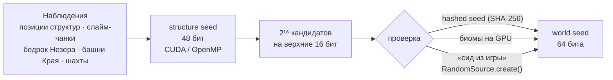
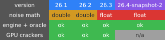
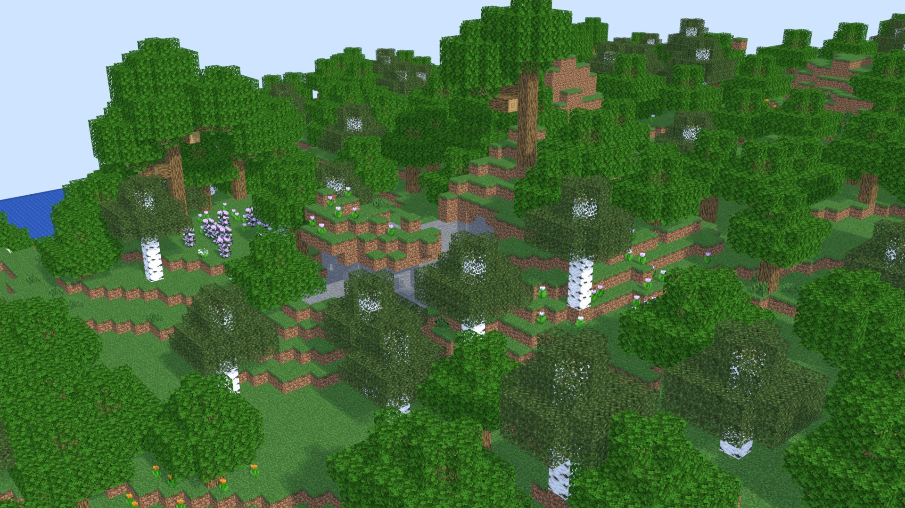
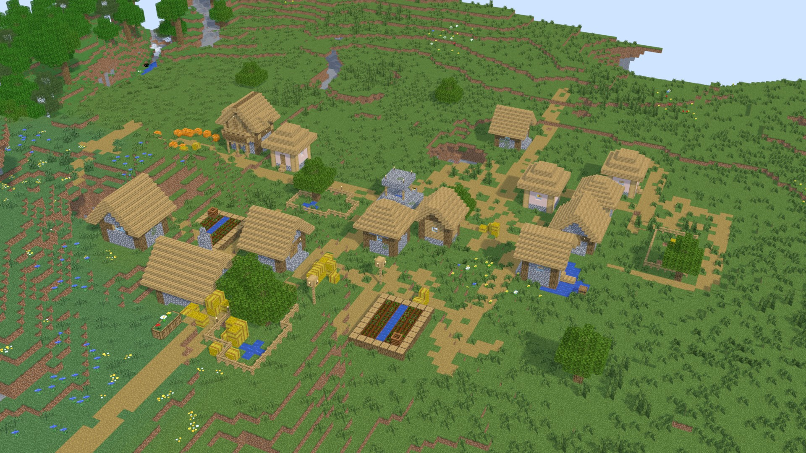
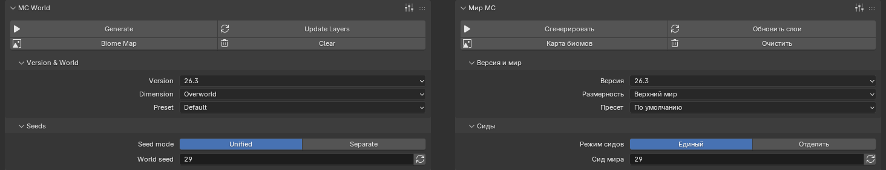
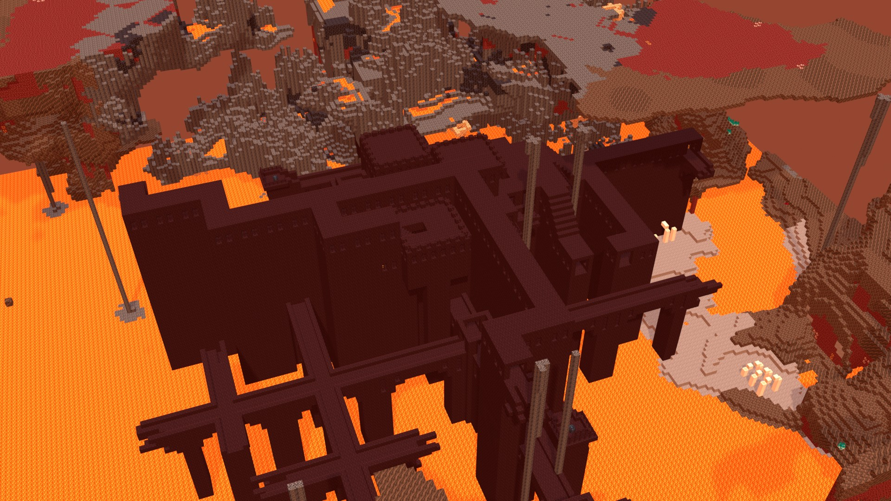

<div align="center">

# ⛏️ mc-worldgen-seed-lab

**Бит-точный порт генерации мира Minecraft 26.x на C/CUDA и набор GPU-инструментов восстановления seed**

Overworld · Nether · End &nbsp;|&nbsp; 26.1 · 26.2 · 26.3 (+ 26.4-snapshot-2) &nbsp;|&nbsp; CUDA · OpenMP · Java-эталон

<a href="LICENSE"></a>
<a href="docs/04-version-diff-26.md"></a>
<a href="docs/13-gpu-strategy.md"></a>
<a href="engine"></a>
<a href="docs/oracle.md"></a>
<a href="docs/00-worldgen-guide.md"></a>
<br>

<a href="docs/23-crack-nether-bedrock.md"></a>


<sub>↑ бейдж Minecraft и нижний ряд (включая анимированный) нарисованы <a href="https://github.com/AlexMelanFromRingo/blazon">blazon</a> — самодостаточным генератором с честными метриками шрифта; остальные — <a href="https://shields.io">shields.io</a></sub>

[Путеводитель по генерации](docs/00-worldgen-guide.md) ·
[Как восстановить seed](docs/13-gpu-strategy.md) ·
[Правила по высоте и температуре](docs/08-height-temperature-rules.md) ·
[Установка](#-быстрый-старт)

</div>

> **English TL;DR.** Since 26.1 Mojang ships Minecraft **without obfuscation**, so the world generator can be read straight from the official server jar.
> This repository contains (1) a full **step-by-step guide** to how a world is derived from a seed (RNG → Perlin/Simplex noise → climate → biomes → terrain → caves → structures → features),
> (2) a **bit-exact C/CUDA port** of the Overworld / Nether / End biome generator for 26.1–26.3, validated against the real game code (Java "oracle"),
> and (3) **GPU seed crackers**: structures → 48-bit structure seed → 64-bit world seed, slime chunks, End pillars, mineshafts, Nether bedrock (full 2⁴⁸ sweep in ≈ 0.16 s kernel time on an RTX 4080 SUPER).
> All prose is in Russian; code, identifiers and CLI are language-neutral. No Mojang files are included — `make setup` fetches the official jar from Mojang.

---

## ✨ Что здесь есть

| | |
|---|---|
| 📖 **Путеводитель «от seed до мира»** | Пошагово, по реальному коду 26.3: генерация чисел (LCG / Xoroshiro128++), шумы Перлина, климат → биомы, рельеф, пещеры, aquifer, поверхность, структуры, фичи. Сквозной числовой пример для seed `12345`. → [`docs/00`](docs/00-worldgen-guide.md) |
| 🧬 **Движок `engine/`** | Один код на C для CPU **и** GPU (`MC_HD`): шум, климат, R-дерево биомов, `BiomeManager`, Nether, End. **Бит-в-бит** с игрой: `float`/`double`-ветки (26.1/26.2 vs 26.3), `-ffp-contract=off` / `--fmad=false`. |
| 🚀 **GPU-краккеры `crack/`** | Структуры → structure seed → world seed · слайм-чанки · башни Края · шахты · бедрок Незера · проверка seed по биомам. Везде fallback на OpenMP без GPU. |
| 🔬 **Эталон `oracle/`** | Java-процесс на **настоящих классах Mojang** (26.1–26.4): каждая формула и каждая таблица сверяется с игрой, а не с памятью. |
| 🗺️ **Каталог правил** | Автоматический перечень всех «если высота / температура / вода …»: 273 размещаемые фичи, правила поверхности, карверы, структуры, снежная линия каждого биома → [`docs/08`](docs/08-height-temperature-rules.md). |
| 🕵️ **Исследование взаимосвязей** | Реки-«петли», азалии, лавовые озёра Незера, снег — что реально следует из кода, а что миф ([`docs/06`](docs/06-interactions.md)). Приём «глина → алмазы» (Zakviel, Reddit) **реально работал в 1.13.2–1.17.1** и объяснён арифметикой LCG; проверено на 14 настоящих серверах ([`docs/07`](docs/07-clay-diamond-by-version.md), [`docs/09`](docs/09-linked-generation-lcg-vs-xoroshiro.md)). |

## 🏁 Результаты (измерено, RTX 4080 SUPER · Ryzen 5 5500 · nvcc 12.0)

| Задача | Результат | Подробности |
|---|---|---|
| **Бедрок Незера → structure seed** (полный перебор 2⁴⁸) | ядро **0,157 с**, «под ключ» **≈ 0,45 с**; оригинал на 12 потоках ≈ 60 с (простаивающая машина) — **×135** «под ключ», ×380 по ядру | [`docs/23`](docs/23-crack-nether-bedrock.md) |
| **Слайм-чанки** | аналитическое решение за **1–2,5 мс** (GPU) / 30 мс (CPU) при N ≥ 12 положительных чанков; совпадает с перебором 2³⁰ бит-в-бит | [`docs/22`](docs/22-crack-slime-pillars.md) |
| **Позиции структур → seed** | lifting младших битов: **0,039 с** (прототип, 6 структур, GPU); **полный перебор 2⁴⁸ измерен**: Nether, 10 структур — **47–81 с** (≈ 6·10¹² значений/с, ×19–33 к прототипу), `end_city` ≈ 160–190 с; сквозной тест на реальном коде игры (26.1–26.3, все три измерения): structure seed и world seed найдены **110/110** | [`docs/20`](docs/20-crack-struct-lift.md), [`docs/13`](docs/13-gpu-strategy.md) |
| **Проверка seed по биомам** (Overworld 26.3) | **1,6–2,2·10⁷ кандидатов/с**; 2¹⁶ кандидатов × 8 наблюдений за 5–8 мс (≈ 100× быстрее CPU); весь диапазон `int32` — **251 с** | [`docs/21`](docs/21-gpu-biomes.md) |
| **Корректность** | движок ↔ игра: 1,24 млн точек, 0 расхождений; GPU ↔ CPU: 15,7 млн точек × 15 конфигураций, 0 расхождений; «известный ответ» 300/300; краккеры слайм/башни/шахты — 713 проверок, 0 провалов | [`docs/oracle.md`](docs/oracle.md) |

> «Под ключ» включает инициализацию CUDA-контекста в WSL2 (0,2–0,4 с). Полный прогон 2⁴⁸ для **шахт** (≈ 29 мин) и режима «только шахты/аванпосты без linear-структур» (≈ 40–47 мин) на GPU **оценён по скорости ядра**, а не снят единым запуском; прогоны по структурам (Nether, End, Overworld-окно 2³⁴) — измерены. Помечено в соответствующих документах.

## 🧭 Конвейер восстановления seed



Почему так: структуры, слайм-чанки, шахты, башни Края и бедрок Незера считаются **LCG от младших 48 бит** seed'а, а биомы Overworld 1.18+ — **Xoroshiro128++ от всех 64 бит**. Поэтому сначала находится 48-битный structure seed, а старшие 16 бит добираются дешёвой проверкой. Детали — [`docs/03`](docs/03-seed-dependency-map.md) и [`docs/13`](docs/13-gpu-strategy.md).

### Поддерживаемые версии



`double` / `float` — две численные ветки генератора шума: в 26.3 Mojang переписал шум на `NoiseStack` с `float`-накоплением, поэтому результаты 26.3 численно отличаются от 26.1/26.2 и порт воспроизводит обе ветки бит-в-бит ([`docs/04`](docs/04-version-diff-26.md), [`docs/05`](docs/05-noise-climate-port.md)).

## 🧱 Blender-аддон «MC Worldgen» (v0.1.10)

Тот же движок вырос в **генератор мира для Blender**: выбираете версию (26.1–26.4), измерение, пресет, сиды (единый или раздельно для климата / рельефа / построек / декораций), область в чанках и слои — и получаете настоящие блоки с текстурами, формами и поворотами из **вашего** клиентского jar (ресурсы Mojang в репозиторий не входят). Ползунки и панели — в духе настроек рендера; чанки хранятся как массивы данных (не объекты), рисуются объединённым мешем с отсечением скрытых граней; строительство и разрушение блоков перестраивают только затронутый чанк (≈4–6 мс). Проект и ворота приёмки — [`docs/superpowers/specs`](docs/superpowers/specs/2026-10-02-blender-worldgen-addon-design.md), текущий статус — [`docs/blender/status.md`](docs/blender/status.md).

<p align="center">
  
  
</p>
<p align="center">
  
  
</p>

**Как пользоваться.** Скачайте zip для своей платформы из [релиза v0.1.10](https://github.com/AlexMelanFromRingo/mc-worldgen-seed-lab/releases/tag/v0.1.10) (или соберите `python3 tools/build_extension.py`) и поставьте его в Blender 4.2+ через **Edit ▸ Preferences ▸ Get Extensions ▸ Install from Disk…**. В **Scene ▸ MC World ▸ Resources** укажите (или найдите кнопкой **Auto-detect**) серверный и клиентский jar одной версии, нажмите **Prepare Resources** (нужна Java 25; ресурсы Mojang берутся из вашего jar и в репозиторий не входят). Затем выберите версию, измерение, seed и область в чанках, включите слои и нажмите **Generate**: мир строится настоящими блоками с текстурами; **Update Layers** пересчитывает только затронутое, **Biome Map** показывает карту биомов, **Structure Markers** отмечает постройки, а подпанель **Edit Blocks** позволяет ставить и ломать блоки (правки сохраняются в .blend). Хотите мир ровно таким, как на вашем сервере — запишите расписание его прогона и укажите файл в поле **Server schedule** ([руководство §4.5](docs/blender/user-guide.md), [почему нужно](docs/blender/nondeterminism.md)). Подробно — [`docs/blender/user-guide.md`](docs/blender/user-guide.md); необязательное ускорение на видеокарте NVIDIA (CUDA: результат бит-в-бит как на CPU; библиотеку под вашу карту собирает кнопка **Build GPU library** вашим nvcc — [руководство §4.12](docs/blender/user-guide.md), [`docs/blender/gpu.md`](docs/blender/gpu.md)). Свои jar — из официального лаунчера, **Prism / MultiMC / PolyMC**, Modrinth App: [руководство §2.1](docs/blender/user-guide.md). Windows: учтены лимит в 259 символов и Blender из Microsoft Store (он прячет AppData от Java и nvcc — кэш там уходит в `%USERPROFILE%\.mcgen`).

Библиотека `libmcgen` (C11, без зависимостей) проверяется **блок-в-блок на настоящем сервере**; стадии изолируются датапаком, поэтому каждая принимается отдельно:

| Стадия | Эталон | Совпадение (измерено) | Где расходится |
|---|---|---|---|
| Рельеф, aquifer, жилы, жидкости, биомы | density-функции против классов игры (все 4 версии); чанки сервера | **100 %** блоков: 26.3 — 47 эталонов, 37 741 чанк, 3,29·10⁹ блоков; 26.2 — 25 эталонов, 17 406 чанков; 26.1 и 26.4 — по одному (124 и 169 чанков); ≈200 чанков/с; **26.1/26.2/26.4 против серверов (G4, 16 областей на версию: Overworld, Незер, Край, 2 сида) — 0 расхождений**; новый сид 424242 (10 областей) — 3 клетки воды из ≈4,8·10⁸ блоков | биомы: **1 клетка 4×4×4 из 51 378 624** (ничья R-дерева); 26.4: биомы игры поблочные, у нас клетки 4×4×4 — точность не заявляется |
| Поверхность (трава, песок, бедрок, полосы глины…) | сервер (26.3), 31 эталон; 26.1/26.2/26.4 — классы игры и серверы (G4) | **100 %**, 2,09·10⁹ блоков (26.3); 26.1 — 184 области, 26.2/26.4 — по 188 против классов игры, 0 расхождений; плюс серверные 16 областей на версию, 0 | биомы: 1 клетка из 32 640 000 |
| Пещеры, каньоны, карверы | сервер (26.3), 61 эталон | **99,99999998 %**: 1 блок из 4,13·10⁹ (50 436 чанков); 26.1/26.2 против классов игры — 0 | **1 блок** `water[level=1]` вместо `level=0` — игра сама рисует эту клетку по-разному (порядок растекания); на новом сиде такие же 3 клетки; 26.4: прежние **131 блок `dirt`↔`grass`** на 324 чанках (сверка с классами игры) на серверных эталонах не воспроизводятся (0 на 16 областях) |
| Постройки (52 типа: деревни, храмы, шахты, крепости, монумент, особняк, бастионы…) | сервер (26.3), 176 миров (131 исходный + 2 новых сида + 14 крепостей), 21 набор; 26.1/26.2/26.4 — по 85–101 миру | старты 679/679 (+ крепости Незера 27/27); блоки построек **99,96 %** (на 131 мире 1 682 из 4 396 393; на 45 новых — 999 из 3 046 688, все у древних городов) | древние города **2 627** (худший мир 99,84 %; два прогона самого сервера расходятся между собой на 1 238 блоков), особняки 28 (99,97 %), шахты 14 (99,89 %), деревни 10 (99,97 %), крепости 2; остальные 16 наборов — 0. **26.1/26.2/26.4:** древние города 2 736/2 401/356, шахты 14, особняки 0–11; у 26.2 один корабль 870 блоков (повторный прогон сервера даёт 0 — недетерминизм), у 26.4 **крепости Незера недетерминированы на самом сервере** (3 мира из 14, повторный прогон даёт другой набор частей). Содержимого сундуков и существ нет |
| Декорации по одной фиче (руды, диски, блобы, озёра, деревья, растительность, подземные) | сервер (26.3), изоляция по одной фиче | **100 %** на 50 из 210 фич | 158 фич реализованы, но проверены только «в сборе»; `ice_patch` — 16 блоков из 7 981 (порядок соседних чанков), `ore_copper_large` — 2 из 11 714 (растекание воды); у `lake_lava_surface` и `spring_lava_frozen` проверка пустая (в эталоне эффекта нет); **26.1/26.2/26.4:** руды и деревья на 26.2 при записанном порядке — 0 расхождений (изолированные миры); у 26.4 найден и исправлен новый алгоритм `OreFeature` |
| Декорации «в сборе» (все фичи, пост-обработка, свет грибов) | сервер (26.3), области r=10 (625 чанков) и 27+3 записанных прогона | порядок по умолчанию: Overworld **99,915–99,993 %**, Nether **99,945–99,998 %**, End 100 % (в G5 и G6 — по 12 из 12 строк выше порога 99,9 %); при воспроизведении записанного расписания сервера (JFR): **0 расхождений на 30 из 30 прогонов** (27 Overworld по 16,6 млн блоков и 3 Nether по 11,1 млн) — [причины и метод](docs/blender/nondeterminism.md) | **без записи расписания:** 4 093–52 039 блоков на область Overworld (≈0,01–0,09 %); у seed 12345 высота верха отличается в **6,6 % колонок** (деревья и листва стоят иначе); на 27 записанных прогонах Overworld по умолчанию медиана 99,74 %, **худший — джунгли 98,4–98,5 %** (две записи самой игры там друг с другом совпадают на 98,6 %), Nether 99,90–99,94 %. Причина — недетерминизм игры (порядок шагов, свет грибов); воспроизводится только по записи |

### Что осталось неточным

* **Декорации без записанного расписания** — главный остаток (строка «в сборе»): игра сама недетерминирована, два её прогона расходятся на ≈0,15–0,25 % блоков (в джунглях на ≈1,4 %), поэтому «100 %» достижимо только против записанного прогона (поле **Server schedule**, [руководство §4.5](docs/blender/user-guide.md)); в плотных лесах отдельные деревья будут стоять иначе, чем на вашем сервере.
* **Версии 26.1, 26.2, 26.4-snapshot-2:** рельеф, поверхность и карверы сверены с серверами (0 расхождений на 16 областях каждой); постройки — на 85–101 мире (см. таблицу). Декорации «в сборе» по умолчанию там заметно хуже, чем у 26.3 (Overworld spawn seed 12345: 99,67–99,72 % против 99,92 %; Nether 99,73–99,82 % против 99,95 %; сам сервер 26.2 с собой — 99,78 %): порядок планировщика откалиброван по 26.3, у старых версий статусы `noise/surface/carvers` раздельные. По записанному расписанию: Nether 26.1/26.2 — 0, 26.4 — 9 блоков; Overworld 26.4 — 13 блоков, 26.1/26.2 — ≈3,1–3,4 тыс. на область 13×13 чанков (0,02 %): причина найдена агентом в игре — чанки, выгруженные на диск и загруженные заново, теряют карты высот `*_WG`, и при первом запросе игра строит их уже с листвой соседей ([§2.4](docs/blender/nondeterminism.md)); расписание момент выгрузки не хранит. Мангровые болота (изолированная фича `trees_mangrove`) при записанном расписании: на 26.2 274 тыс. → **0** блоков (на 26.3 и 26.4 — 0; исправлено условие `would_survive` пропагулы: попытки деревьев по кронам больше не проходят).
* **Постройки:** остатки у древних городов (скалк, порядок соседних чанков; сам сервер расходится с собой), шахт, деревень, особняков (14–2 627 блоков на набор); сундуки и существа не создаются.
* **Свет** не воспроизводится (его даёт Blender); при генерации декораций блочный свет и узкая полоса света от уже освещённых чанков не моделируются.
* **Биомы:** 1 клетка из 51 млн (ничья R-дерева); у 26.4 поблочные биомы приближены клетками 4×4×4.
* **Выборка эталонов:** три сида (12345, 8675309, −7048155917072976836) и ограниченное число областей; проверки на «произвольном» сиде нет.
* **Платформы:** Linux проверен полностью; Windows — библиотека загружается в Blender 5.2, но весь путь «ресурсы → генерация» не подтверждён; macOS собрана и проверена по экспорту, не запускалась; GPU на Windows (сборка вашим nvcc) не проверен.
* Блоки-сущности рисуются заглушками, анимаций нет — это ограничения аддона, не генератора.

```bash
make libmcgen                         # библиотека (gcc); make libmcgen-all — под 4 платформы (zig)
python3 tools/build_extension.py      # blender/dist/mcgen-*.zip → Blender: Edit ▸ Preferences ▸ Get Extensions ▸ Install from Disk
```

## 🚀 Быстрый старт

Нужно: Linux / WSL2, `gcc`, `make`, Python 3, JDK 25 (для эталона и декомпиляции); для GPU — CUDA 12 (`nvcc`) и карта NVIDIA (по умолчанию `sm_89`, для другой — `ARCH=sm_86`).

```bash
git clone https://github.com/AlexMelanFromRingo/mc-worldgen-seed-lab && cd mc-worldgen-seed-lab

# 1. Официальные файлы Mojang (в репозитории их нет): jar → датапак → декомпилят
make setup V="26.3"                       # или V="26.1 26.2 26.3"

# 2. Биомы и климат на движке (проверьте на chunkbase.com!)
make mcquery
tools/mcquery 26.3 ow 12345 0 0 8 8 16    # версия, измерение, seed, qx0 qz0 nx nz qy  (1 кварт = 4 блока)
tools/mcquery 26.3 nether 12345 0 0 4 4 8 --climate

# 3. GPU-инструменты (make crack-cpu — без CUDA)
make crack ARCH=sm_89

# 4. Пример: structure seed по блокам бедрока Незера → world seed
crack/bin/crack-nether-bedrock crack/tests/nether_bedrock/data/example_seed_765906787396911863.txt --world-seed
# → 13375767216887   (world seed игры: 765906787396911863)
```

<details>
<summary><b>Все инструменты и пример вызовов</b></summary>

| Бинарник | Вход → выход | Документ |
|---|---|---|
| `crack-struct` | позиции структур → structure seed (48 бит) | [`docs/20`](docs/20-crack-struct-lift.md) |
| `crack-lift64` | structure seed → world seed: по hashed seed (SHA-256, SHA-NI), по биомам или `--random` — для seed, который игра создала сама при пустом поле (верхние 16 бит восстанавливаются из нижних 48, 300/300) | [`docs/20`](docs/20-crack-struct-lift.md) |
| `crack-biomes` | наблюдения «точка → биомы» → seed (Overworld/Nether/End, `--blocks`, `--ties`) | [`docs/21`](docs/21-gpu-biomes.md) |
| `crack-slime` | карта слайм-чанков → structure seed | [`docs/22`](docs/22-crack-slime-pillars.md) |
| `crack-pillars` | высоты башен Края → pillar key / seed | [`docs/22`](docs/22-crack-slime-pillars.md) |
| `crack-mineshaft` | старт-чанки шахт → seed | [`docs/22`](docs/22-crack-slime-pillars.md) |
| `crack-nether-bedrock` | бедрок/не бедрок потолка и пола Незера → seed | [`docs/23`](docs/23-crack-nether-bedrock.md) |
| `tools/mcquery` | seed → биомы / климатические параметры | [`docs/05`](docs/05-noise-climate-port.md) |

```bash
crack/bin/crack-struct --list-sets --version 26.3            # известные наборы структур и их параметры (читаются из JSON)
crack/bin/crack-struct --version 26.3 obs.txt > cands.txt    # structure seed по позициям структур
crack/bin/crack-lift64 --version 26.3 --seeds cands.txt --hashed H     # world seed по hashed seed из пакета логина
crack/bin/crack-lift64 --version 26.3 --seeds cands.txt --biomes b.txt  # …или по биомам
```

Эталон на реальном коде игры (нужен `make setup`):

```bash
make oracle V=26.3
oracle/run.sh 26.3 serve        # Java-процесс, отвечающий на запросы биомов/шумов/структур
python3 tests/diff_biomes.py --versions 26.3 --dims overworld --seeds 3 --size 32
```

</details>

## 🗂️ Структура репозитория

```
engine/    бит-точный движок генерации (C, host+device): rng · noise · climate · biomes · end · данные
crack/     CUDA/OpenMP-инструменты восстановления seed + их тесты и замеры
oracle/    Java-эталон на настоящих классах Mojang (26.1–26.4), генератор тест-векторов
tests/     дифф-тесты движка против игры, юнит-тесты шума, тест-векторы
tools/     извлечение данных, mcquery, fetch_game.py, аудит взаимосвязей, L3-проверки на реальных чанках
data/      извлечённые таблицы (климат, R-деревья, структуры, порядок фич) и машинные отчёты аудита
docs/      документация (по-русски)
```

## 📚 Документация

| Документ | Тема |
|---|---|
| [**00 · Путеводитель**](docs/00-worldgen-guide.md) | от seed до мира: RNG, шум, климат, биомы, рельеф, пещеры, структуры, фичи, взаимосвязи |
| [01 · RNG и сидирование](docs/01-rng-and-seeding.md) | LCG, Xoroshiro128++, позиционные фабрики, сидеры WorldgenRandom |
| [02 · Размещение структур](docs/02-structure-placement.md) | random_spread, concentric_rings, соль/разброс/«cross-chunk» |
| [03 · Карта зависимости от seed](docs/03-seed-dependency-map.md) | какая часть мира зависит от каких бит seed'а |
| [04 · Отличия 26.1 → 26.3](docs/04-version-diff-26.md) | `double` → `float`, DensityFunctionCompiler, новые биомы/структуры |
| [05 · Порт шума и климата](docs/05-noise-climate-port.md) | как добиться бит-в-бит совпадения с Java |
| [06 · Взаимосвязи в генерации](docs/06-interactions.md) | реки, пещеры, азалии, руды, лава: аудит кода + проверка на реальных чанках |
| [08 · Правила по высоте / температуре](docs/08-height-temperature-rules.md) | полный каталог условий «если y / температура / вода» |
| [07 · «Глина → алмазы» по версиям](docs/07-clay-diamond-by-version.md) | 14 настоящих серверов 1.7.10–26.3: где связь есть, точные смещения по `seed & 15` |
| [09 · «Глина → алмазы»: механизм](docs/09-linked-generation-lcg-vs-xoroshiro.md) | почему приём работал в 1.13–1.17.1 и не работает с 1.18 |
| [10 · SeedcrackerX](docs/10-seedcrackerx.md) · [11 · chunkbase и открытые краккеры](docs/11-chunkbase-and-open-crackers.md) · [12 · бедрок и др.](docs/12-bedrock-and-other-crackers.md) | как это делают другие и что можно переиспользовать |
| [13 · Стратегия GPU](docs/13-gpu-strategy.md) | какие наблюдения сколько бит дают и чем их перебирать |
| [20](docs/20-crack-struct-lift.md) · [21](docs/21-gpu-biomes.md) · [22](docs/22-crack-slime-pillars.md) · [23](docs/23-crack-nether-bedrock.md) | описание и замеры инструментов |
| [oracle](docs/oracle.md) | как устроен Java-эталон |
| [PROJECT.md](PROJECT.md) | раскладка рабочего каталога, факты о версиях 26.1 → 26.3, соглашения |

## 🧪 Как проверяется корректность

1. **Эталон — настоящий код Mojang**, запущенный в процессе (`oracle/`), а не cubiomes и не память.
2. **Дифф-тесты** по всем измерениям, версиям и пресетам (`normal` / `large_biomes` / `amplified`); различия классифицируются как «ничья fitness» (в игре недетерминирована) или ошибка.
3. **GPU ↔ CPU** бит-в-бит на миллионах случайных точек; известный-ответ тесты на 300 реальных seed'ах.
4. **L3: настоящие чанки** — ванильный сервер генерирует мир, `tools/l3_*.py` читает `.mca` и проверяет утверждения о взаимосвязях статистически (с контролем сдвигом).

## ⚠️ Ограничения и честные оговорки

* Репозиторий **не содержит** файлов Mojang (jar, декомпилят, датапак): `make setup` скачивает официальный `server.jar` с серверов Mojang; скачивая его, вы принимаете [Minecraft EULA](https://aka.ms/MinecraftEULA). Таблицы в `data/` — числовые параметры, извлечённые из датапака для совместимости.
* Покрыты версии **26.1, 26.2, 26.3**; `26.4-snapshot-2` поддержан движком и эталоном (в нём изменилась верхняя граница `Climate.Parameter.distance`), краккеры сертифицированы на 26.1–26.3.
* Полный 2⁴⁸ для шахт и режима «только шахты/аванпосты» — **оценка** по стабильной скорости ядра, не единый запуск (для структур — измерено, `docs/20`). Lifting мог бы потерять верный seed с вероятностью ≈ 2·10⁻⁸ на структуру (отбраковка `nextInt`); полный перебор точен.
* Проверки на реальных чанках (L3) выполнены на 26.3 и ограниченном числе seed'ов.
* Инструменты предназначены для исследования, образования и восстановления **собственных** потерянных seed'ов. Не используйте их, чтобы получить преимущество на серверах, где это запрещено правилами.

## 🙏 Благодарности

[cubiomes](https://github.com/Cubitect/cubiomes) · [SeedcrackerX](https://github.com/19MisterX98/SeedcrackerX) · [SeedCracker](https://github.com/KaptainWutax/SeedCracker) · [Nether Bedrock Cracker](https://github.com/19MisterX98/Nether_Bedrock_Cracker) · [seedfinding](https://github.com/SeedFinding) · [chunkbase](https://www.chunkbase.com) (сравнительные скриншоты в `docs/img/` — для проверки совпадения карт) · [Vineflower](https://github.com/Vineflower/vineflower) · [blazon](https://github.com/AlexMelanFromRingo/blazon) и [shields.io](https://shields.io) (бейджи).

Minecraft — торговая марка Mojang Studios / Microsoft. Проект не связан с Mojang и не одобрен ими.

## 💖 Поддержать проект

> [!TIP]
>
> Проект бесплатный и под лицензией MIT. Если он оказался полезен, можно поддержать разработку криптовалютой ❤️
>
> **BTC** (SegWit): `bc1qd0t6uhrgq8ck74n3g2fweq4kfw35as66gne72y`  
> **LTC**: `ltc1q2ku8rax5wgcuhh8m03k8gyng8ggj9svkjn6fq4`  
> **BCH**: `qqkgr48fjxf0rf9cpd9zdjdpkuu29nhfj5y4hcdhfm`  
> **TON**: `UQCKG4T2Csv5dGK24w1e8ndd96VuBanYey5tvzGeJkFW_09x`  
> **ETH** (Ethereum / EVM, ERC‑20): `0x3729c742E6eF4552ad32c08f61804308CB1Cffd8`  
> **ETC**: `0xB3a6Fa84556d562F1E7ceD5C8452985d1aDAf572`  
> **RVN**: `RX7zXpdzH8GoBpHzzuVes3DN7znbwaWi4z`  
>
> Перед отправкой проверьте сеть: средства, отправленные не в той сети, вернуть нельзя.

## 📄 Лицензия

[MIT](LICENSE) — на код и документацию репозитория. Данные и код игры принадлежат Mojang Studios.
