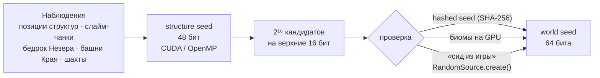

<div align="center">

# ⛏️ mc-worldgen-seed-lab

**Бит-точный порт генерации мира Minecraft 26.x на C/CUDA и набор GPU-инструментов восстановления seed**

Overworld · Nether · End &nbsp;|&nbsp; 26.1 · 26.2 · 26.3 (+ 26.4-snapshot-2) &nbsp;|&nbsp; CUDA · OpenMP · Java-эталон

[](LICENSE)
[](docs/04-version-diff-26.md)
[](docs/13-gpu-strategy.md)
[](engine)
[](docs/oracle.md)
[](docs/00-worldgen-guide.md)

[Путеводитель по генерации](docs/00-worldgen-guide.md) ·
[Как восстановить seed](docs/13-gpu-strategy.md) ·
[Правила по высоте и температуре](docs/08-height-temperature-rules.md) ·
[Установка](#-быстрый-старт)

</div>

> **English TL;DR.** Since 26.1 Mojang ships Minecraft **without obfuscation**, so the world generator can be read straight from the official server jar.
> This repository contains (1) a full **step-by-step guide** to how a world is derived from a seed (RNG → Perlin/Simplex noise → climate → biomes → terrain → caves → structures → features),
> (2) a **bit-exact C/CUDA port** of the Overworld / Nether / End biome generator for 26.1–26.3, validated against the real game code (Java "oracle"),
> and (3) **GPU seed crackers**: structures → 48-bit structure seed → 64-bit world seed, slime chunks, End pillars, mineshafts, Nether bedrock (full 2⁴⁸ sweep in ≈ 0.16 s kernel time on an RTX 4080 SUPER).
> All prose is in Russian; code, identifiers and CLI are language-neutral. No Mojang files are included — `make setup` fetches the official jar from Mojang.

---

## ✨ Что здесь есть

| | |
|---|---|
| 📖 **Путеводитель «от seed до мира»** | Пошагово, по реальному коду 26.3: генерация чисел (LCG / Xoroshiro128++), шумы Перлина, климат → биомы, рельеф, пещеры, aquifer, поверхность, структуры, фичи. Сквозной числовой пример для seed `12345`. → [`docs/00`](docs/00-worldgen-guide.md) |
| 🧬 **Движок `engine/`** | Один код на C для CPU **и** GPU (`MC_HD`): шум, климат, R-дерево биомов, `BiomeManager`, Nether, End. **Бит-в-бит** с игрой: `float`/`double`-ветки (26.1/26.2 vs 26.3), `-ffp-contract=off` / `--fmad=false`. |
| 🚀 **GPU-краккеры `crack/`** | Структуры → structure seed → world seed · слайм-чанки · башни Края · шахты · бедрок Незера · проверка seed по биомам. Везде fallback на OpenMP без GPU. |
| 🔬 **Эталон `oracle/`** | Java-процесс на **настоящих классах Mojang** (26.1–26.4): каждая формула и каждая таблица сверяется с игрой, а не с памятью. |
| 🗺️ **Каталог правил** | Автоматический перечень всех «если высота / температура / вода …»: 273 размещаемые фичи, правила поверхности, карверы, структуры, снежная линия каждого биома → [`docs/08`](docs/08-height-temperature-rules.md). |
| 🕵️ **Исследование взаимосвязей** | Реки-«петли», «глина → алмазы», азалии, лавовые озёра Незера, снег — что реально следует из кода, а что миф ([`docs/06`](docs/06-interactions.md), [`docs/09`](docs/09-linked-generation-lcg-vs-xoroshiro.md)). |

## 🏁 Результаты (измерено, RTX 4080 SUPER · Ryzen 5 5500 · nvcc 12.0)

| Задача | Результат | Подробности |
|---|---|---|
| **Бедрок Незера → structure seed** (полный перебор 2⁴⁸) | ядро **0,157 с**, «под ключ» **≈ 0,45 с**; оригинал на 12 потоках ≈ 60 с (простаивающая машина) — **×135** «под ключ», ×380 по ядру | [`docs/23`](docs/23-crack-nether-bedrock.md) |
| **Слайм-чанки** | аналитическое решение за **1–2,5 мс** (GPU) / 30 мс (CPU) при N ≥ 12 положительных чанков; совпадает с перебором 2³⁰ бит-в-бит | [`docs/22`](docs/22-crack-slime-pillars.md) |
| **Позиции структур** (lifting младших битов) | 6 структур: **0,039 с** (GPU) / 0,73 с (CPU); полный 2⁴⁸ ≈ 25,6 мин на GPU (экстраполяция по замеру 1,83·10¹¹/с) | [`docs/20`](docs/20-crack-struct-lift.md), [`docs/13`](docs/13-gpu-strategy.md) |
| **Проверка seed по биомам** (Overworld 26.3) | **1,6–2,2·10⁷ кандидатов/с**; 2¹⁶ кандидатов × 8 наблюдений за 5–8 мс (≈ 100× быстрее CPU); весь диапазон `int32` — **251 с** | [`docs/21`](docs/21-gpu-biomes.md) |
| **Корректность** | движок ↔ игра: 1,24 млн точек, 0 расхождений; GPU ↔ CPU: 15,7 млн точек × 15 конфигураций, 0 расхождений; «известный ответ» 300/300; краккеры слайм/башни/шахты — 713 проверок, 0 провалов | [`docs/oracle.md`](docs/oracle.md) |

> «Под ключ» включает инициализацию CUDA-контекста в WSL2 (0,2–0,4 с). Полный прогон 2⁴⁸ для шахт и структур без lifting на GPU **экстраполирован**, а не снят единым запуском — это явно помечено в соответствующих документах.

## 🧭 Конвейер восстановления seed



Почему так: структуры, слайм-чанки, шахты, башни Края и бедрок Незера считаются **LCG от младших 48 бит** seed'а, а биомы Overworld 1.18+ — **Xoroshiro128++ от всех 64 бит**. Поэтому сначала находится 48-битный structure seed, а старшие 16 бит добираются дешёвой проверкой. Детали — [`docs/03`](docs/03-seed-dependency-map.md) и [`docs/13`](docs/13-gpu-strategy.md).

## 🚀 Быстрый старт

Нужно: Linux / WSL2, `gcc`, `make`, Python 3, JDK 25 (для эталона и декомпиляции); для GPU — CUDA 12 (`nvcc`) и карта NVIDIA (по умолчанию `sm_89`, для другой — `ARCH=sm_86`).

```bash
git clone https://github.com/AlexMelanFromRingo/mc-worldgen-seed-lab && cd mc-worldgen-seed-lab

# 1. Официальные файлы Mojang (в репозитории их нет): jar → датапак → декомпилят
make setup V="26.3"                       # или V="26.1 26.2 26.3"

# 2. Биомы и климат на движке (проверьте на chunkbase.com!)
make mcquery
tools/mcquery 26.3 ow 12345 0 0 8 8 16    # версия, измерение, seed, qx0 qz0 nx nz qy  (1 кварт = 4 блока)
tools/mcquery 26.3 nether 12345 0 0 4 4 8 --climate

# 3. GPU-инструменты (make crack-cpu — без CUDA)
make crack ARCH=sm_89

# 4. Пример: structure seed по блокам бедрока Незера → world seed
crack/bin/crack-nether-bedrock crack/tests/nether_bedrock/data/example_seed_765906787396911863.txt --world-seed
# → 13375767216887   (world seed игры: 765906787396911863)
```

<details>
<summary><b>Все инструменты и пример вызовов</b></summary>

| Бинарник | Вход → выход | Документ |
|---|---|---|
| `crack-struct` | позиции структур → structure seed (48 бит) | [`docs/20`](docs/20-crack-struct-lift.md) |
| `crack-lift64` | structure seed → world seed (hashed seed / биомы / «seed из игры») | [`docs/20`](docs/20-crack-struct-lift.md) |
| `crack-biomes` | наблюдения «точка → биомы» → seed (Overworld/Nether/End, `--blocks`, `--ties`) | [`docs/21`](docs/21-gpu-biomes.md) |
| `crack-slime` | карта слайм-чанков → structure seed | [`docs/22`](docs/22-crack-slime-pillars.md) |
| `crack-pillars` | высоты башен Края → pillar key / seed | [`docs/22`](docs/22-crack-slime-pillars.md) |
| `crack-mineshaft` | старт-чанки шахт → seed | [`docs/22`](docs/22-crack-slime-pillars.md) |
| `crack-nether-bedrock` | бедрок/не бедрок потолка и пола Незера → seed | [`docs/23`](docs/23-crack-nether-bedrock.md) |
| `tools/mcquery` | seed → биомы / климатические параметры | [`docs/05`](docs/05-noise-climate-port.md) |

```bash
crack/bin/crack-struct --list-sets --version 26.3            # известные наборы структур и их параметры (читаются из JSON)
crack/bin/crack-struct --version 26.3 obs.txt > cands.txt    # structure seed по позициям структур
crack/bin/crack-lift64 --version 26.3 --seeds cands.txt --hashed H     # world seed по hashed seed из пакета логина
crack/bin/crack-lift64 --version 26.3 --seeds cands.txt --biomes b.txt  # …или по биомам
```

Эталон на реальном коде игры (нужен `make setup`):

```bash
make oracle V=26.3
oracle/run.sh 26.3 serve        # Java-процесс, отвечающий на запросы биомов/шумов/структур
python3 tests/diff_biomes.py --versions 26.3 --dims overworld --seeds 3 --size 32
```

</details>

## 🗂️ Структура репозитория

```
engine/    бит-точный движок генерации (C, host+device): rng · noise · climate · biomes · end · данные
crack/     CUDA/OpenMP-инструменты восстановления seed + их тесты и замеры
oracle/    Java-эталон на настоящих классах Mojang (26.1–26.4), генератор тест-векторов
tests/     дифф-тесты движка против игры, юнит-тесты шума, тест-векторы
tools/     извлечение данных, mcquery, fetch_game.py, аудит взаимосвязей, L3-проверки на реальных чанках
data/      извлечённые таблицы (климат, R-деревья, структуры, порядок фич) и машинные отчёты аудита
docs/      документация (по-русски)
```

## 📚 Документация

| Документ | Тема |
|---|---|
| [**00 · Путеводитель**](docs/00-worldgen-guide.md) | от seed до мира: RNG, шум, климат, биомы, рельеф, пещеры, структуры, фичи, взаимосвязи |
| [01 · RNG и сидирование](docs/01-rng-and-seeding.md) | LCG, Xoroshiro128++, позиционные фабрики, сидеры WorldgenRandom |
| [02 · Размещение структур](docs/02-structure-placement.md) | random_spread, concentric_rings, соль/разброс/«cross-chunk» |
| [03 · Карта зависимости от seed](docs/03-seed-dependency-map.md) | какая часть мира зависит от каких бит seed'а |
| [04 · Отличия 26.1 → 26.3](docs/04-version-diff-26.md) | `double` → `float`, DensityFunctionCompiler, новые биомы/структуры |
| [05 · Порт шума и климата](docs/05-noise-climate-port.md) | как добиться бит-в-бит совпадения с Java |
| [06 · Взаимосвязи в генерации](docs/06-interactions.md) | реки, пещеры, азалии, руды, лава: аудит кода + проверка на реальных чанках |
| [08 · Правила по высоте / температуре](docs/08-height-temperature-rules.md) | полный каталог условий «если y / температура / вода» |
| [09 · «Глина → алмазы»](docs/09-linked-generation-lcg-vs-xoroshiro.md) | почему приём работал до 1.17.1 и не работает с 1.18 |
| [10 · SeedcrackerX](docs/10-seedcrackerx.md) · [11 · chunkbase и открытые краккеры](docs/11-chunkbase-and-open-crackers.md) · [12 · бедрок и др.](docs/12-bedrock-and-other-crackers.md) | как это делают другие и что можно переиспользовать |
| [13 · Стратегия GPU](docs/13-gpu-strategy.md) | какие наблюдения сколько бит дают и чем их перебирать |
| [20](docs/20-crack-struct-lift.md) · [21](docs/21-gpu-biomes.md) · [22](docs/22-crack-slime-pillars.md) · [23](docs/23-crack-nether-bedrock.md) | описание и замеры инструментов |
| [oracle](docs/oracle.md) | как устроен Java-эталон |

## 🧪 Как проверяется корректность

1. **Эталон — настоящий код Mojang**, запущенный в процессе (`oracle/`), а не cubiomes и не память.
2. **Дифф-тесты** по всем измерениям, версиям и пресетам (`normal` / `large_biomes` / `amplified`); различия классифицируются как «ничья fitness» (в игре недетерминирована) или ошибка.
3. **GPU ↔ CPU** бит-в-бит на миллионах случайных точек; известный-ответ тесты на 300 реальных seed'ах.
4. **L3: настоящие чанки** — ванильный сервер генерирует мир, `tools/l3_*.py` читает `.mca` и проверяет утверждения о взаимосвязях статистически (с контролем сдвигом).

## ⚠️ Ограничения и честные оговорки

* Репозиторий **не содержит** файлов Mojang (jar, декомпилят, датапак): `make setup` скачивает официальный `server.jar` с серверов Mojang; скачивая его, вы принимаете [Minecraft EULA](https://aka.ms/MinecraftEULA). Таблицы в `data/` — числовые параметры, извлечённые из датапака для совместимости.
* Покрыты версии **26.1, 26.2, 26.3**; `26.4-snapshot-2` поддержан движком и эталоном (в нём изменилась верхняя граница `Climate.Parameter.distance`), краккеры сертифицированы на 26.1–26.3.
* Полные прогоны 2⁴⁸ на GPU для шахт и структур без lifting — **экстраполяция** по стабильной скорости ядра, не единый запуск.
* Проверки на реальных чанках (L3) выполнены на 26.3 и ограниченном числе seed'ов.
* Инструменты предназначены для исследования, образования и восстановления **собственных** потерянных seed'ов. Не используйте их, чтобы получить преимущество на серверах, где это запрещено правилами.

## 🙏 Благодарности

[cubiomes](https://github.com/Cubitect/cubiomes) · [SeedcrackerX](https://github.com/19MisterX98/SeedcrackerX) · [SeedCracker](https://github.com/KaptainWutax/SeedCracker) · [Nether Bedrock Cracker](https://github.com/19MisterX98/Nether_Bedrock_Cracker) · [seedfinding](https://github.com/SeedFinding) · [chunkbase](https://www.chunkbase.com) (сравнительные скриншоты в `docs/img/` — для проверки совпадения карт) · [Vineflower](https://github.com/Vineflower/vineflower).

Minecraft — торговая марка Mojang Studios / Microsoft. Проект не связан с Mojang и не одобрен ими.

## 📄 Лицензия

[MIT](LICENSE) — на код и документацию репозитория. Данные и код игры принадлежат Mojang Studios.
