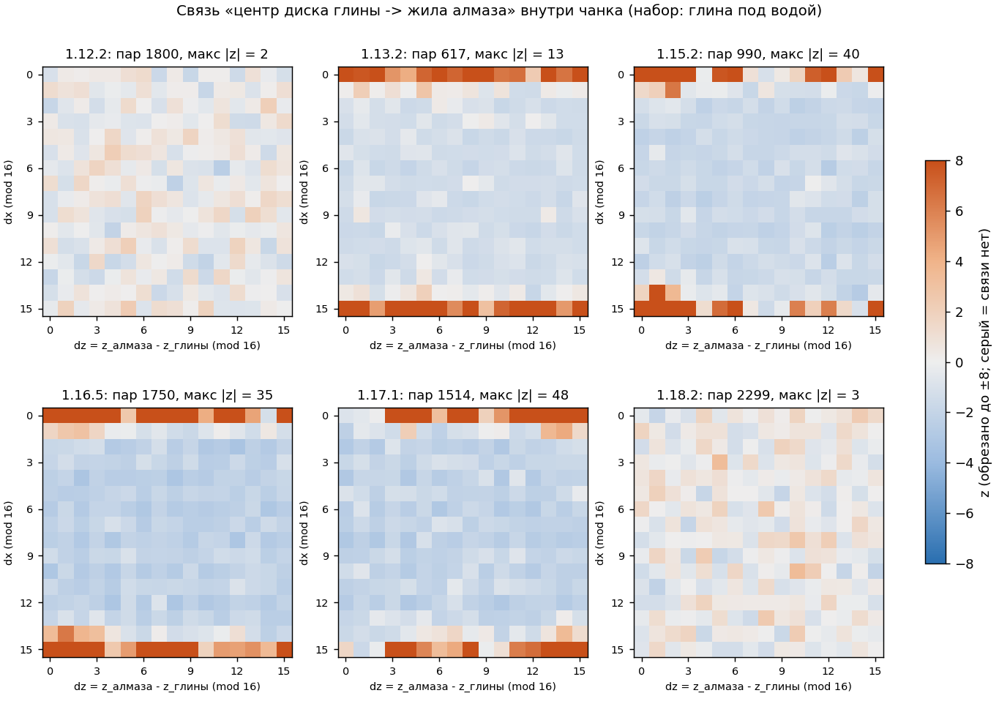

# 07. «Глина → алмазы»: в каких версиях Java Edition такая связь существовала и каково смещение

Продолжение `docs/06-interactions.md` §10 (там на 26.3 связи не нашли). Здесь тот же вопрос проверен на **настоящих серверах 1.7.10 … 1.21.11 и 26.3** (всё сгенерировано ванильными серверами Mojang, EULA принимается вами вручную: `tools/l3_fetch_server.py --accept-eula`) и доведён до **точного правила**.

Повод: пост Reddit r/Minecraft «Diamonds and clay linked generation?» (март 2021, 1.16.5) и ролик Zakviel: «найди круглое глиняное пятно, найди ЦЕНТР, отойди на N блоков (зависит от биома), копай вниз». Reddit: **2 блока на юг** в обычных биомах с озёрами/глиной (20–30 проверок), **2 на север** в биомах рек (5–7), **8 на север** в болотах (10–11), успех 80 %+ (в творческом режиме); «в ≥ 1.17/1.18 не работает».

## 0. Итог

| Версия | Связь «центр диска глины → жила алмаза в том же чанке»? |
|---|---|
| 1.7.10, 1.8.9, 1.12.2 | **нет** (140 / 60 / 63 миров; чувствительность ≈ 1.0–1.6 % связанных пар) |
| 1.13.2, 1.14.4 | **есть, но только по оси X**: x жилы = x центра диска (97.7 % точно, 98.8 % ±1); z у жилы не связан (равномерный). Копать нужно траншею вдоль z в пределах чанка |
| **1.15.2, 1.16.5, 1.17.1** | **есть по обеим осям**: x жилы = x центра диска; z жилы = z центра + Δz, где Δz — небольшое число, зависящее от **биома (списка фич)** и от **seed мира mod 16** (таблицы §4). Это и есть «трюк» |
| 1.18, 1.18.2, 1.19.4, 1.20.6, 1.21.11, 26.3 | **нет** |

* **Механизм (проверен воспроизведением ГСЧ, §3):** до 1.17.1 включительно у каждой фичи собственный `java.util.Random` с seed `decorationSeed + index + 10000·step`. У диска глины (`disk_clay`) и алмаза (`ore_diamond`) индексы в списке фич биома различаются на малую константу d (1.13.2–1.16.5: диск глины = алмаз + 3, в болоте + 2; 1.17.1: + 4 / + 3). Seed'ы двух фич отличаются на малое целое, а LCG линеен: разность состояний после k шагов = A^k·δ. Первое число (nextInt(16) = x) у обеих фич **совпадает**, второе (z) отличается на детерминированный сдвиг. С 1.18 `WorldgenRandom` строится над `XoroshiroRandomSource`, `setSeed` растягивает 64 бита до 128 через `mixStafford13`, соседние seed'ы фич становятся независимыми — связь исчезает (первая проверенная версия без неё — 1.18, см. таблицу; 1.17.1 — последняя со связью).
* **Точное правило (1.15.2–1.17.1):** в чанке с центром диска (x_c, z_c) начало жилы алмаза (x_d, z_d, y_d): **x_d = x_c** (97.7 %), **z_d = z_c + Δz (mod 16 внутри чанка)**, y_d = третий nextInt(16) (0…15, равномерно, не связан). Жила занимает **2×2 колонки (x_d−1…x_d, z_d−1…z_d)**, в каждой из четырёх алмаз есть в ~62 % случаев, хотя бы в одной — ~79 % (остальное съедено пещерами). Δz — см. таблицы §4: в 1.16.5 для «обычного» биома Δz ∈ {+2 (s0=1,9,13), +3 (0,2,8,10,12,14), +4 (3,7,11,15)} с вероятностью 70–92 %, для болота {+6, ±8, 0}; в 1.17.1 для обычного биома Δz = −1 (78 %) / −2 (22 %) при 12 из 16 seed.
* **Вероятность успеха «копай вниз из точки (x_c−1…x_c, z_c+Δz−1)»** (точный центр диска, смещение откалибровано по миру): 1 колонка **0.37–0.65**, 2×2 колонки **0.55–0.76** (с учётом границы чанка 0.71–0.82) для «хороших» s0; для «плохих» s0 (где Δz размазан по 3–4 значениям) 0.05–0.25. Если центр определять на глаз по пятну (центроид глиняных блоков), успех ниже: 1 колонка 0.12–0.27, 2×2 0.4–0.6 (§5). Reddit-овское «80 %+» воспроизводится только при точном центре и копании 2×2 в «хорошем» мире.
* **Reddit vs. данные (§6):** «обычный биом: 2 к югу; болото: 8 к северу» одновременно получается при seed mod 16 ∈ {0, 8, 12} в 1.16.5 (обычный: Δz=+3 → колонка z_c+2…z_c+3 = «2 к югу»; болото: Δz=±8). «Реки: 2 к северу» в 1.16.5 **не воспроизводится**: у реки тот же список фич, что у обычного биома (в 1.17.1 «2 к северу» получается для обычных биомов и рек при 12 из 16 seed). Правило **зависит от seed** — ролик, снятый на одном-двух мирах, не универсален.
* **Почему «после 1.17/1.18 не работает»:** с 1.18 — Xoroshiro (связи нет вообще); а в 1.17.x индексы сдвинулись (алмаз 9→11, глина 12→15, d: 3→4), поэтому прежнее число блоков (+2/+3 юг) даёт **−1…−2 (север)**, и «старый рецепт» промахивается.



*Рис.: z-карты 16×16 смещений (dx mod 16, dz mod 16) между центром диска глины под водой и центром жилы алмаза в одном чанке (z = (набл. − контроль)/√контроль; серый = связи нет). Строки dx=0 и dx=15 (±1 из-за оценки центра) — у 1.13.2 вся полоса по dz, у 1.15.2/1.16.5/1.17.1 — сгущение в нескольких клетках; у 1.12.2 и 1.18.2 фон. 1.15.2 — 4 мира (s0 = 9, 0, 1, 5), 1.16.5 — 10 миров с разными s0, 1.17.1 — 7: карты суммируют миры с разными s0, поэтому пики размазаны по нескольким клеткам.*

## 1. Данные и методика

Ванильные серверные jar'ы из манифеста Mojang (`research/manifest.json`), скачаны `tools/l3_fetch_server.py` в `run/oldver/<версия>/`. Java: системные JDK из `/usr/lib/jvm` (скачивать Temurin не потребовалось): ≤ 1.16.5 → Java 8, 1.17.1–1.19.4 → 17, 1.20.6 / 1.21.11 → 21, 26.3 → 25. `tools/l3_gen_old.py` (генерация), `tools/l3_anvil_legacy.py` (читатель .mca всех поколений формата).

| Версия | Как сгенерировано | Миров (seed) | Чанков со статусом full / populated |
|---|---|---|---|
| 1.7.10, 1.8.9, 1.12.2 | область спавна (`Preparing spawn area`, 625 чанков, 576 «populated»); `level.dat` — обычный мир | 140 / 60 / 63 (seed 3001…3140, 4001…4060, 1001…1063) | 80 656 / 34 628 / 36 362 populated |
| 1.13.2 | то же (forceload в 1.13 нет); 625 чанков `postprocessed`/`fullchunk` | 22 (5001…5022) | 13 760 |
| 1.14.4, 1.15.2 | `forceload add` квадрата r=40 (seed 12345) + r=20 (seed 2000, 2001 [и 2005 для 1.15.2]) | 3 / 4 (s0 = 9, 0, 1 [, 5]) | 11 367 / 13 507 |
| 1.16.5 | forceload r=40 (seed 12345) + r=8 (seed 9001) + r=20 (seed 2000, 2001, 2003–2008) | 10 | 24 750 |
| 1.17.1 | forceload r=40 (12345) + r=20 (2000, 2001, 2003–2006) | 7 | 19 774 |
| 1.18, 1.18.2, 1.19.4, 1.20.6, 1.21.11 | forceload r=40 (1.18: r=32) | по 1 (seed 12345) | 7 225 (1.18: 4 225) |
| 26.3 | прежний прогон `tools/l3_gen.py` | 1 (12345) | 7 225 |

Читатель .mca: ≤ 1.12 — `Level.Sections[].Blocks/Add` (глина = id 82, алмазная руда = 56, вода = 8/9, индекс `y·256+z·16+x`); 1.13–1.15 — `Palette + BlockStates` с пересечением границы long (DataVersion < 2529); 1.16–1.17 — без пересечения; ≥ 1.18 — `sections[].block_states`. Проверка читателя: у всех версий алмазы только на y ≤ 15 (1.18+: ≥ −64), глина диска ≈ y 50–62; для 1.18+ счёт алмазов совпал с прежним `l3_anvil.py`.

**Центры месторождений.** Глина (y > 30): компоненты связности 26-соседством с габаритом ≤ 7×7 по xz и ≤ 4 по y — «диск» (радиус 2–3, высота 3); центр = центроид; «под водой» = у какого-либо блока над ним вода/водоросли. Алмазы: компоненты связности (жилы); центр = центроид. «Точный диск» — полный круг радиуса 2/3 (13 или 29 колонок) — центр известен точно (используется для подгонки индексов).

**Контроль («нулевое распределение»)** — релокация: диск (все его блоки/центр) переносится на вектор, кратный 16, в случайный ДРУГОЙ внутренний чанк (≥ 3 чанков от исходного); сохраняются положение внутри чанка, локальная плотность алмазов и распределение по y; разрушается только связь «этот диск — этот чанк». (Циклический сдвиг за границу области из первого варианта давал пустой контроль; побочный урок этой работы: релокация **блоков** по одному завышала σ контроля, потому что блоки диска коррелированы — надо переносить диск целиком.) Три теста:

* **(A)** окно смещений (dx,dz) ∈ [−16,16]² центров глины → центров жил: макс |z| по ячейкам против максимумов в контролях;
* **(B)** таблица 16×16 (dx mod 16, dz mod 16) пар **в одной ячейке (чанке)**: χ² против контролей (z-оценка и ранговое p);
* **(C)** «блочное окно» — как в `l3_clay_diamond.py`: dx,dz ∈ [−16,16], dy ∈ [−140,−20], блоки глины (диски целиком, до ≈ 6000 блоков на мир) → блоки алмаза; в кадре популяции (≤ 1.12: чанк популяции начинается с +8, ставились оба кадра, смотри оговорки) и в кадре чанка.

Чувствительность: «f_min» — наименьшая доля пар таблицы (B), которую искусственно «сдвинули» в одну ячейку и тест уверенно (z > 5) заметил бы.

## 2. Таблица по версиям

Набор «глина под водой» (диск, у которого над каким-нибудь блоком вода); (C) — блоки, (A)/(B) — центры. «набл. / контроль ± σ» — число пар в окне; «макс |z|» — набл. / среднее по контролям (максимум по контролям); (B) — z-оценка χ² относительно контролей (К = 48 контролей, ранговое p ≥ 0.02 минимально).

| Версия | миров | чанков full / populated | блоков глины y>30 (из них над водой) | блоков алмаза | центров дисков под водой | (C) пар в окне: набл. / контроль ± σ | (C) макс \|z\|: набл. / контроли ср. (макс) | (A) макс \|z\| центров | (B) χ² z (ранг. p) | f_min | Вывод |
|---|---|---|---|---|---|---|---|---|---|---|---|
| 1.7.10 | 140 | 80656 | 121608 (80128) | 255958 | 5054 | 893634 / 900914 ± 7542 | 6.0 / 6.2 (7.8) | 4.2 / 3.7 (7.1) | 1.4 (p=0.12) | 1.0% | **нет** |
| 1.8.9 | 60 | 34628 | 51517 (32920) | 121652 | 2175 | 403115 / 402597 ± 4655 | 7.1 / 6.1 (7.4) | 3.4 / 3.9 (4.7) | -3.0 (p=1.00) | 1.6% | **нет** |
| 1.12.2 | 63 | 36362 | 57597 (37750) | 127815 | 2278 | 447741 / 444781 ± 4586 | 6.7 / 6.5 (8.9) | 3.6 / 3.9 (5.3) | -0.5 (p=0.65) | 1.6% | **нет** |
| 1.13.2 | 22 | 13760 | 18452 (12389) | 48996 | 751 | 147496 / 142348 ± 2705 | 41.4 / 6.6 (8.3) | 10.9 / 4.5 (6.2) | 81.6 (p=0.02) | 2.8% | **ЕСТЬ, только x** |
| 1.14.4 | 3 | 11367 | 17437 (12167) | 40838 | 856 | 142250 / 153847 ± 1999 | 33.9 / 6.5 (8.6) | 13.5 / 4.4 (5.8) | 85.0 (p=0.02) | 2.8% | **ЕСТЬ, только x** |
| 1.15.2 | 4 | 13507 | 26719 (19443) | 49014 | 1242 | 240621 / 250125 ± 2642 | 92.5 / 6.7 (9.0) | 39.9 / 4.1 (5.4) | 285.3 (p=0.02) | 2.4% | **ЕСТЬ (x и z)** |
| 1.16.5 | 10 | 24750 | 47244 (32724) | 90471 | 2188 | 416762 / 424924 ± 5313 | 82.0 / 6.5 (8.4) | 31.8 / 3.9 (5.1) | 382.9 (p=0.02) | 1.6% | **ЕСТЬ (x и z)** |
| 1.17.1 | 7 | 19774 | 41684 (29454) | 71617 | 1872 | 353138 / 358129 ± 4749 | 82.2 / 6.7 (9.0) | 54.1 / 4.0 (6.1) | 436.7 (p=0.02) | 1.8% | **ЕСТЬ (x и z)** |
| 1.18 | 1 | 4761 | 1636452 (25959) | 72505 | 405 | 335899 / 350138 ± 7825 | 6.6 / 5.9 (7.1) | 3.6 / 4.0 (5.3) | 1.4 (p=0.08) | 2.0% | **нет** |
| 1.18.2 | 1 | 7225 | 1921640 (31930) | 110448 | 547 | 349312 / 352712 ± 11344 | 5.8 / 6.0 (7.1) | 3.6 / 4.0 (5.8) | 0.3 (p=0.41) | 1.6% | **нет** |
| 1.19.4 | 1 | 7225 | 1916575 (31128) | 106175 | 552 | 351579 / 345482 ± 9923 | 5.0 / 5.8 (7.2) | 3.7 / 3.9 (5.6) | 1.5 (p=0.12) | 1.6% | **нет** |
| 1.20.6 | 1 | 7225 | 1952666 (31065) | 170745 | 547 | 509222 / 520807 ± 10321 | 5.0 / 6.1 (8.4) | 3.9 / 3.7 (4.9) | 0.6 (p=0.29) | 1.4% | **нет** |
| 1.21.11 | 1 | 7225 | 1961235 (30812) | 170144 | 554 | 559473 / 562814 ± 10690 | 5.7 / 6.1 (8.3) | 4.0 / 3.7 (5.6) | 1.4 (p=0.10) | 1.2% | **нет** |
| 26.3 | 1 | 7225 | 1957275 (30594) | 170103 | 554 | 526291 / 528079 ± 13056 | 5.8 / 6.0 (8.2) | 4.6 / 3.8 (5.5) | 1.5 (p=0.06) | 1.2% | **нет** |

Вывод по столбцам: связь есть там, где максимум |z| наблюдений на порядок выше максимума в контролях (1.13.2–1.17.1: (C) 34–92 против ≤ 9; (B) χ² z 82–437 против 0±1; (A) 11–54 против ≤ 6). В ≤ 1.12.2 и ≥ 1.18 наблюдаемые максимумы (A) и (C) лежат **внутри** диапазона контролей, χ² z (B) ∈ [−3.0, 1.5] (отрицательные — обычная недодисперсия χ² у наблюдений). (В версиях со связью число пар в окне (C) даже на 2–8 % ниже контрольного: пики узкие, а возле воды плотность алмазов в окрестности меньше, чем в среднем по миру; решает максимум |z| по ячейкам, а не сумма.) Чувствительность f_min: 1.0–2.0 % связанных пар для миров ≤ 1.12.2 и ≥ 1.18, 1.6–2.8 % для версий со связью (там её уже и так видно в десятки σ).

Замечания к таблице: (1) для ≤ 1.12.2 приведён кадр популяции (+8); другой кадр (0): 1.7.10 (140 миров) χ² z = 2.0–2.2 при 200 контролях (p_rank 0.02–0.035; при 48 контролях выходило и 3.2 — оценка шумит), 1.8.9 −0.2…−0.8, 1.12.2 +1.0. Это слабое отклонение у одной версии из двенадцати сравнений (3 версии × 2 кадра × 2 набора), оно не воспроизводится ни в кадре +8, ни в тестах (A), (C), ни при делении миров пополам (χ² z 2.4 / 0.9), ни в 1.8.9/1.12.2 — шум. (2) в 1.18+ счёт «блоков глины y>30» огромен (≈ 1.9 млн, на 98 % — не над водой): это не диски, а, по-видимому, подземная глина новых пещер; поэтому основным взят набор «под водой» + габарит диска ≤ 7×7×4 (в нём ≈ 550 дисков на мир, как и у 1.16.5/1.17.1). (3) Числа (C) не совпадают с `docs/06` §10 (177 799 против 184 651 ± 4 769): там окно ±14, dy ∈ [−135,−25], 3000 случайных блоков, контроль 24 циклических сдвига; здесь окно ±16, диски переносятся целиком, 48 контролей — для 26.3 вывод тот же (нет связи).

## 3. Механизм (проверен воспроизведением ГСЧ)

### 3.1. Seed'ы фич в 1.13 – 1.17.1

```
r = new Random(worldSeed); a = r.nextLong() | 1; b = r.nextLong() | 1
decSeed(cx,cz) = (16·cx·a + 16·cz·b) ^ worldSeed                 // setDecorationSeed(worldSeed, X=16cx, Z=16cz)
featSeed(i, step) = decSeed + i + 10000·step                      // setFeatureSeed; i — индекс фичи в списке биома на шаге step
Random(featSeed): S0 = (featSeed ^ A) & (2^48-1);  S(k+1) = (S(k)·A + 0xB) mod 2^48;  A = 0x5DEECE66D;   nextInt(16) = S(k) >> 44
```

Для фич с seed'ами f_c (глина) и f_d (алмаз): `S_k(c) − S_k(d) ≡ A^k · δ' (mod 2^48)`, где `δ' = (f_c ^ A) − (f_d ^ A)` — **малое** целое (XOR с A меняет разность только через цепочки переноса в младших битах).

* **A ≈ 2^34.5**, значит при |δ'| < 697 разность первых состояний `A·δ'` < 2^44, и **первый `nextInt(16)` (x) у обеих фич совпадает** (±1 из-за переноса — ≈ 1–2 %): P(dx = 0) = 97.7 %, P(|dx| ≤ 1) = 98.8 % для d = 3.
* **A² mod 2^48 = 0xBB20B4600A69 = 11.695 · 2^44**, значит **второй `nextInt(16)` (z) отличается на ≈ 11.695·δ' (mod 16)** (±1 перенос): `z_алмаз − z_глина ≡ −11.695·δ'`. Пример (1.16.5, s0 = 9, d = 3): δ' = −7 всегда ⇒ −11.695·(−7) = 81.9 ≡ **+2** (наблюдалось +2: 87 % ячеек). Для s0 = 0: δ' = −3 ⇒ **+3** (наблюдалось +3: 92 %).
* **A³ mod 2^48 = 0xD498BD0AC4B5 = 13.29 · 2^44**: у алмаза в 1.13.2/1.14.4 `nextInt(16)` для z — **третий** (порядок вызовов x, y, z — установлен по данным: только при нём предсказанное начало жилы совпадает с реальной жилой, 0.87 против 0.23), у глины z — второй; третье число алмаза зависит от всех битов второго состояния глины, а не только от старших четырёх ⇒ **z не связан** (поэтому в 1.13.2/1.14.4 связь только по x). В 1.15.2 порядок у алмаза x, z, y (так же в 1.16.5/1.17.1), поэтому связаны x и z.
* **Почему зависит от seed мира.** `X = 16cx, Z = 16cz` кратны 16 ⇒ младшие 4 бита decSeed = `worldSeed & 15` в **каждом** чанке мира, бит 4 = бит 4 seed XOR чётность (cx+cz). Поэтому δ' (а с ним и Δz) определяется в основном `s0 = worldSeed & 15`: при s0 = 9 и d = 3 цепочек переноса нет (δ' = −7 всегда), при s0 = 5 δ' принимает значения {25, −39, 217, −807, …} (длинные переносы) — смещение размазывается. Выше 5-го бита зависимость слабая (мода Δz даёт 75 % попаданий по 4 битам, 80 % по 5, 82 % по 10).
* **Что определяет d.** `d = idx_глины − idx_алмаза` — разность индексов в списке фич биома на шаге `UNDERGROUND_ORES`. Это разные списки у биомов (отсюда «зависит от биома»): у болота нет `disk_sand` перед глиной (d меньше на 1). Индексы найдены подгонкой по реальным мирам (§4).

Модельное распределение для «случайного» seed (поле `z_алмаз − z_глина` в блоках, mod 16 со знаком; `tools/l3_lcg_model.py`, 300 000 выборок на d):

| d | P(dx=0) | z_алмаз − z_глина (вероятности) |
|---|---|---|
| 1 | 0.991 | −4: 0.37, −5: 0.24, −3: 0.23, −6: 0.10 |
| 2 (болото 1.13–1.16) | 0.983 | +6: 0.31, −7: 0.30, +8: 0.20, +7: 0.06 |
| 3 (обычный 1.13–1.16, болото 1.17) | 0.977 | +3: 0.34, +4: 0.21, +2: 0.16, +5: 0.08 |
| 4 (обычный 1.17.1) | 0.971 | −1: 0.58, −2: 0.16, +5: 0.09, −7: 0.07 |
| 5 | 0.965 | −5: 0.24, −6: 0.23, −4: 0.13, −7: 0.09 |
| 6 | 0.958 | +5: 0.24, +7: 0.23, +8: 0.15, −1: 0.09 |
| 7 | 0.951 | +2: 0.22, +3: 0.17, +1: 0.11, +8: 0.08 |
| 8 | 0.945 | −2: 0.28, −3: 0.22, +7: 0.17, +4: 0.15 |
| 12 | 0.922 | +6: 0.34, +3: 0.17, −4: 0.16, +2: 0.11 |

Для **конкретного** seed пики острее (см. §4): знание `worldSeed & 15` убирает размазывание от «случайных старших битов».

### 3.2. Версии ≤ 1.12.2 (один последовательный Random)

Все фичи чанка берут числа из одного потока (`population`), seed чанка `(cx·xmul + cz·zmul) ^ worldSeed`. Положения диска и жилы — старшие 4 бита состояний, отстоящих на k ≥ 2 шагов (между ними десятки вызовов: рудные жилы потребляют `nextDouble`/`nextFloat`, плюс 1–4 попытки песка с переменным числом вызовов). Проверка `tools/l3_lcg_chain.py` (400 000 случайных состояний, k = 1…300): χ² пары (nextInt(16) на шаге n, на шаге n+k) = 259 ± 22 при ожидании 255 ± 22.6, ни одного k с отклонением > 4σ: **старшие 4 бита на любых расстояниях независимы**, поэтому связи в принципе нет; эмпирически (140/60/63 мира) её тоже нет.

### 3.3. 1.18 и позже

В `ChunkGenerator.applyBiomeDecoration` 26.3 (`src/dec/26.3/net/minecraft/world/level/chunk/ChunkGenerator.java:359-360`) `WorldgenRandom` создаётся над `XoroshiroRandomSource`, а `setFeatureSeed` по-прежнему `seed + index + 10000·step` (`world/level/levelgen/WorldgenRandom.java:53-56`); но `XoroshiroRandomSource.setSeed` (`XoroshiroRandomSource.java:43-44`) растягивает 64-битный seed до 128 бит через `RandomSupport.upgradeSeedTo128bit` + `mixStafford13` по обеим половинам (`RandomSupport.java:17-31, 54`), поэтому seed'ы `decSeed + i` и `decSeed + i + d` дают независимые потоки (для 1.18.2–1.21.11 исходники не декомпилированы — вывод по данным). Эмпирически: на 1.18.2 подгонка индексов по Java-Random-воспроизведению даёт только фон (доля ячеек с алмазом в предсказанной колонке 0.06–0.09 против 0.6 для 1.16.5), связи (A)(B)(C) нет, как и на 1.19.4, 1.20.6, 1.21.11, 26.3.

## 4. Точное правило

### 4.1. Индексы фич (подгонка по реальным мирам: `tools/l3_chunk_rule.py --replay`)

Для каждого биома (id биома в центре чанка: клетка (2,2,2) массива `Biomes` в 1.15–1.17, колонка (8,8) в 1.13–1.14) перебираем (step, index) и считаем долю чанков, где в 2×2 колонок у предсказанного начала жилы есть алмаз (правильный индекс ≈ 0.6 на колонку, неверный ≈ 0.01), и долю «точных дисков» (полный круг), центр которых совпал с предсказанным **точно** (правильный индекс = 1.00, ближайший ложный 0.5–0.7).

| Версия | step (UNDERGROUND_ORES) | порядок вызовов у алмаза | idx алмаза | idx глины: обычный биом и река | idx глины: болото (6, 134) | d обычный / болото | точных дисков в подгонке |
|---|---|---|---|---|---|---|---|
| 1.13.2 | 4 | x, y, z | 9 | 12 | 11 | 3 / 2 | 65 / 69 (1.00) |
| 1.14.4 | 4 | x, y, z | 9 | 12 | 11 | 3 / 2 | 59 / 77 (1.00) |
| 1.15.2 | 4 | x, z, y | 9 | 12 | 11 | 3 / 2 | 56 / 77 (1.00) |
| 1.16.5 | 6 | x, z, y | 9 | 12 | 11 | 3 / 2 | 37 / 69 (1.00) |
| 1.17.1 | 6 | x, z, y | 11 | 15 | 14 | 4 / 3 | 62 / 76 (1.00) |

Расшифровка индексов — гипотеза (по порядку регистрации; декомпиляция этих версий не делалась): …`ore_redstone`=8, `ore_diamond`=9, `ore_lapis`=10, `disk_sand`=11, `disk_clay`=12, `disk_gravel`=13 (болото: `disk_clay`=11 — без песка); в 1.17.1 перед алмазом, по-видимому, добавились две фичи (новые руды 1.17), отсюда 11 / 15 / 14 — это предположение, подгонка даёт только числа. Исключения по биомам: 1.16.5 gravelly mountains (131) — алмаз idx 20, 1.14.4 taiga mountains (133) — idx 21 (подгонка по жилам, без дисков). Для 1.13.2 индексы одинаковы у всех 22 проверенных биомов (в т.ч. океаны 0, 24, 44–50: диски глины в океанах работают так же).

Проверка калькулятора `tools/l3_trick.py` (по seed и чанку предсказывает центр диска и начало жилы): **центры всех «точных» дисков угаданы без единой ошибки** — 116/116 (1.16.5), 142/142 (1.15.2), 144/144 (1.17.1); для 6724 внутренних чанков в 2×2 колонок у предсказанного начала жилы есть алмазная руда в 79 % (фон ≈ 2 %).

Footprint жилы: колонки `(x_d−1…x_d, z_d−1…z_d)`: P(есть алмаз) = 0.62 / 0.63 / 0.62 / 0.62 (каждая из четырёх, 1.16.5 и 1.17.1), хотя бы в одной 0.79; вне квадрата ≈ 0.

### 4.2. Смещение Δz = z_алмаз − z_глина (центр диска → начало жилы) по seed мира

x_d = x_c (97.7 %, ±1: 98.8 %). (Наблюдаемые по блокам сдвиги центроидов на ≈ 1 меньше: центроид жилы лежит в углу 2×2 footprint, т.е. (x_d−0.5, z_d−0.5): в 1.16.5, s0=9, обычный биом по блокам пик (0,+1) при предсказании +2.) Δz — три наиболее вероятных значения и их вероятности (знак: + к югу, +z; значения mod 16 приведены к диапазону −7…+8, так что «−7 / +8» — два соседних значения 9 и 8 mod 16). Таблицы — по `s0 = worldSeed & 15` (для отрицательного seed — `seed & 15` в дополнительном коде); получены моделью `tools/l3_seed_dependence.py`, подтверждены на реальных мирах (§5). **1.15.2 и 1.16.5** (обычный биом и река d = 3; болото d = 2; step 4 и 6 дают одну и ту же таблицу):

| s0 | обычный биом / река | болото |
|---|---|---|
| 0 | +3 (0.92), +4 | −7 (0.60), +8 (0.40) |
| 1 | +2 (0.87), +1 | +6 (0.82), +7 |
| 2 | +3 (0.92), +4 | +6 (0.83), +7 |
| 3 | +4 (0.70), +5 (0.30) | −7 (0.61), +8 (0.39) |
| 4 | −3 (0.42), −7, −6 (размазано) | −7 (0.61), +8 (0.39) |
| 5 | −4 (0.32), +8 (0.31), −5 (размазано) | 0 (0.49), −4 (0.20), −3 |
| 6 | −3 (0.46), −7, −6 (размазано) | 0 (0.51), −4, −3 |
| 7 | +4 (0.70), +5 (0.30) | −7 (0.61), +8 (0.39) |
| 8 | +3 (0.92), +4 | −7 (0.61), +8 (0.39) |
| 9 | +2 (0.87), +1 | +6 (0.83), +7 |
| 10 | +3 (0.91), +4 | +6 (0.83), +7 |
| 11 | +4 (0.70), +5 | −7 (0.60), +8 (0.40) |
| 12 | +3 (0.91), +4 | −7 (0.61), +8 (0.39) |
| 13 | +2 (0.87), +1 | +6 (0.83), +7 |
| 14 | +3 (0.91), +4 | +6 (0.83), +7 |
| 15 | +4 (0.70), +5 | −7 (0.61), +8 (0.39) |

**1.17.1** (обычный/река d = 4, болото d = 3):

| s0 | обычный биом / река | болото |
|---|---|---|
| 0 | −1 (0.78), −2 (0.22) | +3 (0.91), +4 |
| 1 | −7 (0.32), +5 (0.29), +8 (0.28) (размазано) | +4 (0.69), +5 |
| 2 | +5 (0.36), −7, +8 (размазано) | −3 (0.42), −7, −6 (размазано) |
| 3 | +5 (0.37), −7, +8 (размазано) | +8 (0.34), −4, −5 (размазано) |
| 4 | +5 (0.36), −7, +8 (размазано) | −3 (0.42), −7, −6 (размазано) |
| 5 | −1 (0.78), −2 (0.22) | +4 (0.69), +5 (0.31) |
| 6, 8, 10, 12, 14 | −1 (0.78), −2 (0.22) | +3 (0.91), +4 (0.09) |
| 7, 11, 15 | −1 (0.78), −2 (0.22) | +2 (0.86), +1 (0.14) |
| 9, 13 | −1 (0.78), −2 (0.22) | +4 (0.69), +5 (0.31) |

В 1.17.1 для обычных биомов и рек при **12 из 16** seed получается «жила на 1–2 блока к северу от центра» (колонки z_c−2…z_c−1 — вот откуда «2 к северу»).

**1.13.2 и 1.14.4:** Δx = 0 (97.7 %), Δz — равномерный (каждое из 16 значений 6–7 %; модель и данные совпали). Практическое правило: жила лежит в одной из двух колонок x_c−1…x_c, где-то в пределах чанка по z, y ∈ [0,15] — **траншея** вдоль z на всю длину чанка через центр диска содержит алмаз в **78.5 % (1.14.4, 3 мира, 773 диска) / 78.9 % (1.13.2, 22 мира, 644 диска)** случаев (контроль — полоса со сдвигом на 5 по x: 6 % / 4 %).

### 4.3. «Диск существует» и центр

Диск `disk_clay` появляется только если центр (x_c, z_c) под водой и в слое y−1…y+1 есть земля/глина (песок и гравий не заменяются), поэтому видимое пятно часто неполное; центр надо находить по кругу радиуса 2–3 (полный круг: 13 или 29 колонок). Жила алмаза существует **всегда**, независимо от того, появился ли диск. Калькулятор `tools/l3_trick.py` даёт обе точки по seed без поиска диска.

## 5. Вероятность успеха «трюка»

Определение. Диск «существует», если наблюдаемая глина целиком лежит в круге радиуса 3 вокруг предсказанного центра (чтобы не зависеть от того, что игрок «видит»). Игрок идёт от центра диска на Δz = m (мода из §4.2) и копает вниз; успех = в колонке (колонках) под точкой есть алмазная руда (любой y ≤ 15). Правила: **R1** — одна колонка (x_c−1, z_c+m−1); **R2** — две колонки (x_c−1…x_c, z_c+m−1); **R3** — квадрат 2×2 (x_c−1…x_c, z_c+m−1…z_c+m). Три варианта «центра»: **точный** (из ГСЧ или идеально по кругу), **с учётом границы чанка** (цель z_t = z_c,loc + m mod 16 в том же чанке — игрок знает chunk-координаты по F3), **оценка** (центроид глиняных блоков — то, что игрок видит; для неполного диска центр сдвинут). База — случайная колонка: 1 % (одна колонка), 2.3 % (2×2).

| Версия | мир (seed) | s0 | биом | дисков | мода Δz (доля) | точный центр R1 / R2 / R3 | с учётом чанка R1 / R3 | оценка центра R1 / R2 / R3 |
|---|---|---|---|---|---|---|---|---|
| 1.15.2 | 2000 | 0 | обычный | 178 | +3 (0.91) | 0.44 / 0.53 / 0.65 | 0.56 / 0.81 | 0.15 / 0.30 / 0.53 |
| 1.15.2 | 2001 | 1 | обычный | 118 | +2 (0.85) | 0.57 / 0.67 / 0.71 | 0.63 / 0.78 | 0.25 / 0.37 / 0.53 |
| 1.15.2 | 2005 | 5 | обычный | 99 | +8 (0.32) | 0.07 / 0.07 / 0.15 | 0.12 / 0.25 | 0.03 / 0.09 / 0.12 |
| 1.15.2 | 2005 | 5 | болото | 250 | +0 (0.47) | 0.26 / 0.32 / 0.36 | 0.26 / 0.36 | 0.08 / 0.19 / 0.32 |
| 1.15.2 | 12345 | 9 | обычный | 365 | +2 (0.87) | 0.50 / 0.65 / 0.71 | 0.55 / 0.76 | 0.20 / 0.41 / 0.54 |
| 1.15.2 | 12345 | 9 | болото | 107 | +6 (0.83) | 0.34 / 0.38 / 0.49 | 0.56 / 0.78 | 0.07 / 0.15 / 0.45 |
| 1.16.5 | 2000 | 0 | обычный | 188 | +3 (0.92) | 0.37 / 0.46 / 0.61 | 0.47 / 0.76 | 0.12 / 0.25 / 0.46 |
| 1.16.5 | 2001 | 1 | обычный | 116 | +2 (0.87) | 0.54 / 0.67 / 0.72 | 0.58 / 0.78 | 0.24 / 0.36 / 0.54 |
| 1.16.5 | 2003 | 3 | обычный | 62 | +4 (0.70) | 0.37 / 0.42 / 0.55 | 0.45 / 0.74 | 0.08 / 0.19 / 0.39 |
| 1.16.5 | 2003 | 3 | болото | 329 | -7 (0.58) | 0.32 / 0.40 / 0.41 | 0.58 / 0.74 | 0.14 / 0.23 / 0.39 |
| 1.16.5 | 2004 | 4 | обычный | 70 | -3 (0.42) | 0.51 / 0.57 / 0.60 | 0.54 / 0.66 | 0.16 / 0.23 / 0.39 |
| 1.16.5 | 2005 | 5 | обычный | 108 | +8 (0.33) | 0.11 / 0.11 / 0.14 | 0.18 / 0.29 | 0.03 / 0.06 / 0.08 |
| 1.16.5 | 2005 | 5 | болото | 285 | +0 (0.48) | 0.29 / 0.33 / 0.39 | 0.29 / 0.39 | 0.10 / 0.16 / 0.35 |
| 1.16.5 | 2006 | 6 | обычный | 85 | -3 (0.41) | 0.24 / 0.32 / 0.36 | 0.31 / 0.47 | 0.09 / 0.15 / 0.25 |
| 1.16.5 | 2007 | 7 | обычный | 57 | +4 (0.71) | 0.44 / 0.53 / 0.68 | 0.54 / 0.82 | 0.18 / 0.26 / 0.46 |
| 1.16.5 | 2008 | 8 | обычный | 84 | +3 (0.91) | 0.42 / 0.46 / 0.63 | 0.49 / 0.74 | 0.15 / 0.30 / 0.46 |
| 1.16.5 | 2008 | 8 | болото | 78 | -7 (0.58) | 0.29 / 0.35 / 0.38 | 0.55 / 0.67 | 0.06 / 0.23 / 0.33 |
| 1.16.5 | 12345 | 9 | обычный | 337 | +2 (0.87) | 0.58 / 0.68 / 0.71 | 0.64 / 0.78 | 0.16 / 0.38 / 0.53 |
| 1.16.5 | 9001 | 9 | обычный | 37 | +2 (0.87) | 0.65 / 0.68 / 0.76 | 0.65 / 0.76 | 0.27 / 0.38 / 0.49 |
| 1.16.5 | 12345 | 9 | болото | 108 | +6 (0.84) | 0.26 / 0.28 / 0.38 | 0.51 / 0.70 | 0.04 / 0.14 / 0.31 |
| 1.17.1 | 2000 | 0 | обычный | 165 | -1 (0.79) | 0.57 / 0.66 / 0.70 | 0.58 / 0.71 | 0.19 / 0.37 / 0.58 |
| 1.17.1 | 2001 | 1 | обычный | 72 | +5 (0.36) | 0.06 / 0.06 / 0.07 | 0.08 / 0.11 | 0.01 / 0.03 / 0.04 |
| 1.17.1 | 2003 | 3 | обычный | 59 | +5 (0.36) | 0.05 / 0.14 / 0.15 | 0.14 / 0.27 | 0.03 / 0.12 / 0.12 |
| 1.17.1 | 2003 | 3 | болото | 327 | -4 (0.33) | 0.24 / 0.30 / 0.31 | 0.31 / 0.39 | 0.05 / 0.16 / 0.28 |
| 1.17.1 | 2004 | 4 | обычный | 104 | +5 (0.36) | 0.14 / 0.22 / 0.24 | 0.18 / 0.30 | 0.07 / 0.12 / 0.17 |
| 1.17.1 | 2005 | 5 | обычный | 103 | -1 (0.80) | 0.49 / 0.65 / 0.72 | 0.50 / 0.76 | 0.11 / 0.22 / 0.52 |
| 1.17.1 | 2005 | 5 | болото | 274 | +4 (0.73) | 0.39 / 0.44 / 0.61 | 0.49 / 0.78 | 0.16 / 0.25 / 0.51 |
| 1.17.1 | 2006 | 6 | обычный | 96 | -1 (0.78) | 0.56 / 0.67 / 0.72 | 0.59 / 0.75 | 0.16 / 0.34 / 0.59 |
| 1.17.1 | 12345 | 9 | обычный | 410 | -1 (0.78) | 0.58 / 0.69 / 0.75 | 0.60 / 0.77 | 0.20 / 0.43 / 0.62 |
| 1.17.1 | 12345 | 9 | болото | 103 | +4 (0.71) | 0.30 / 0.39 / 0.57 | 0.38 / 0.74 | 0.04 / 0.13 / 0.35 |

Выводы:

* В «хороших» классах (Δz сосредоточен на одном значении ≥ 70 %: 1.16.5 s0 ∈ {0–3, 7–15}, 1.17.1 s0 ∈ {0, 5–15}) при точном центре **одна колонка — 0.37–0.65**, **2×2 — 0.55–0.76**; с учётом границы чанка (F3): 1 колонка 0.45–0.65, **2×2 0.71–0.82** (потолок — 0.79 = доля чанков, где жила хоть где-то в 2×2 осталась после пещер). Это согласуется с «80 %+» из Reddit только для копания 2×2 (или нескольких тоннелей) при точном центре.
* В «плохих» классах (Δz размазан по 3–4 значениям: 1.16.5 s0 = 5, 6 (и 4); 1.17.1 s0 = 1–4) успех падает до 0.05–0.25 (исключение — 1.16.5 s0 = 4: 0.51 по 70 дискам, вероятно, случайность) — фиксированное смещение не работает, трюк «ломается» именно в таких мирах.
* Если центр оценивать по видимому пятну (центроид глиняных блоков), успех: 1 колонка **0.12–0.27**, 2×2 **0.4–0.6** — центр неполного диска сдвинут, а промах на 1 блок при footprint 2×2 стоит половины успеха.
* Среднее по проверенным мирам (с весом по числу дисков): 1.16.5 обычный биом — точный центр R1 0.44 / R3 0.59, с учётом чанка 0.51 / 0.69, оценка центра 0.14 / 0.43; болото 0.30 / 0.40 (учёт чанка 0.46 / 0.60); 1.17.1 обычный — 0.45 / 0.60 (0.48 / 0.63; оценка 0.15 / 0.49); болото 0.31 / 0.46. Мода Δz, посчитанная воспроизведением ГСЧ по конкретному миру, совпала с модельной таблицей §4.2 в 26 из 30 пар (мир, класс), в остальных 4 — это второе по вероятности значение (в этих классах Δz размазан); независимое подтверждение по блокам — столбцы успеха: в классах с острым Δz результат в 25–65 раз выше базы.
* Глубина: y жилы — третий nextInt(16), 0…15 равномерно (не связан с глиной); диски лежат на y ≈ 53–77 (среднее 60), поэтому dy = y_жилы − y_глины ≈ −52 (5–95 %: −60…−44). Фиксированного dy нет.
* 1.13.2 / 1.14.4: единственный практический способ — траншея вдоль z через центр диска (2 колонки шириной, 16 блоков длиной): 78.5–79 % против 4–6 % контроля; одной колонкой — 0.10–0.15 (по x попадаем точно, по z — наугад).

## 6. Сравнение с Reddit

| Утверждение Reddit (1.16.5) | Наши данные (1.16.5; d = idx_глины − idx_алмаза) |
|---|---|
| обычные биомы с озёрами/глиной: 2 блока к югу (20–30 проверок) | d = 3: Δz = +2 (s0 ∈ {1, 9, 13}), +3 (s0 ∈ {0, 2, 8, 10, 12, 14}), +4 (s0 ∈ {3, 7, 11, 15}); колонки жилы z_c+Δz−1…z_c+Δz, т.е. «2 к югу» — это Δz = +2 или +3 |
| реки: 2 блока к северу (5–7) | **не воспроизводится**: у реки список фич тот же (idx 9/12), Δz как у обычного биома. В 1.17.1 обычные биомы и реки дают «2 к северу» (Δz = −1/−2) при 12 из 16 seed |
| болота: 8 блоков к северу (10–11) | d = 2: Δz = −7 / +8 при s0 ∈ {0, 3, 4, 7, 8, 11, 12, 15} («8 к северу» или «8 к югу» — зависит от z_c в чанке: при z_c,loc ≥ 8 цель к северу, иначе к югу); +6 при s0 ∈ {1, 2, 9, 10, 13, 14} |
| успех 80 %+ (творческий режим) | точный центр, 2×2, учёт чанка: 0.71–0.82; одна колонка 0.4–0.6; по глазу — 0.12–0.27 / 0.4–0.6 |
| ≥ 1.17/1.18 не работает | 1.17.1 работает, но с другими индексами (d: 3→4, алмаз 9→11), поэтому старые «+2 юг» дают −1…−2; с 1.18 связи нет (Xoroshiro) |

Одновременно «обычный +2…+3 к югу» и «болото 8» получается при **s0 ∈ {0, 8, 12}** (1.16.5); живой пример — мир seed 2008 (s0 = 8): обычный биом Δz = +3 (91 %; колонки z_c+2…z_c+3 — «2 к югу»; 2×2 даёт 0.63, с учётом чанка 0.74), болото Δz = −7 (58 %) / +8 (40 %) (колонки z_c−8…z_c−7 — «8 к северу» — или z_c+7…z_c+8; 2×2 с учётом чанка 0.67). То есть утверждения Reddit — правдоподобные округления того, что видно в мире, где `seed & 15` ∈ {0, 8, 12}; в другом мире числа были бы другими (±1…±5), а в мирах с `seed & 15` ∈ {4, 5, 6} правила вообще нет. Прямой проверки именно их миров у нас нет.

## 7. Что не удалось / оговорки

* Проверены версии из списка плюс 1.15.2 и 1.18 (граничная проверка). **Не проверены** промежуточные релизы (1.13, 1.13.1, 1.14–1.14.3, 1.15–1.15.1, 1.16–1.16.4, 1.17.0) и снапшоты 1.18; значит «связь есть в 1.13.2 … 1.17.1» доказано для этих пяти точек, для промежуточных — по аналогии (общий код `setFeatureSeed`); индексы фич между подверсиями могли отличаться (списки фич биомов менялись), а измерены они только на 1.13.2, 1.14.4, 1.15.2, 1.16.5 и 1.17.1.
* Миры 1.18+ — по одному seed (12345); 1.14.4 — 3 мира (s0 = 9, 0, 1), 1.15.2 — 4 (s0 = 9, 0, 1, 5), 1.16.5 — 10 (s0 = 0, 1, 3–9), 1.17.1 — 7 (s0 = 0, 1, 3, 4, 5, 6, 9); для остальных s0 (10–15 и пропущенных) таблицы §4.2 — только модель; модельная мода совпала с воспроизведением ГСЧ по миру в 26 из 30 пар (мир, класс), в остальных — второе по вероятности значение.
* Индексы подогнаны по биомам, присутствующим в проверенных мирах (1.16.5: плейнс, лес, тайга, река, болото, горы, берёза и др.; 1.13.2: ещё океаны, пустыня, джунгли, саванна, мезы и др.). Для редких биомов (131, 133, джунгли и пр. в 1.14–1.17) подгонка по жилам без дисков, значения индексов (20, 21) ненадёжны. В болотах (id 6 и 134) индексы подтверждены 69–84 точными дисками на версию.
* Биом для списка фич — биом в центре чанка (клетка (2,2,2) в 1.15–1.17, колонка (8,8) в 1.13–1.14); на границах биомов диск и жила всё равно выбираются по биому чанка популяции, а не по биому, в котором стоит игрок.
* Для ≤ 1.12.2 «чанк популяции» начинается со сдвига +8; ставились оба кадра (+8 и 0), вывод «нет связи» от кадра не зависит (1.7.10 в кадре 0 при 140 мирах и 200 контролях: χ² z = 2.0–2.2, p ≈ 0.02–0.035 — слабое значение при 12 сравнениях, не воспроизводится при делении миров пополам и в кадре +8, см. замечание (1) к таблице §2).
* «Чувствительность» (f_min) рассчитана инъекцией в таблицу (B) связанных пар в одну ячейку; если бы связь была размазана по десяткам ячеек, порог был бы выше. Для 1.18+ у каждого чанка по нескольку жил, поэтому доля «связанных» пар в любом случае мала (1/7 для первой из семи попыток) — но подгонка Java-Random-воспроизведения на 1.18.2 показывает фон, так что дело не в мощности.
* Reddit/Zakviel: сами их наблюдения и миры мы не видели; сопоставление — по правдоподобию (§6).
* Не использовался клиент/креатив: «успех» считается по данным чанков (наличие руды в колонке), а не по реальному копанию; руда, вскрытая воздухом, в 1.13–1.17 не отбрасывается, но пещеры вырезают часть жил (потолок 0.79).

## 8. Воспроизведение

```
python3 tools/l3_fetch_server.py 1.16.5 1.12.2 ...                            # jar (+ eula.txt только с флагом --accept-eula) в run/oldver/<версия>/
python3 tools/l3_gen_old.py --ver 1.16.5 --seeds 12345 --radius 40            # >= 1.14: forceload (6561+ чанков, ~10 мин)
python3 tools/l3_gen_old.py --ver 1.12.2 --seeds $(seq 1001 1063)             # <= 1.13: область спавна (1 seed ≈ 20–45 с)
python3 tools/l3_anvil_legacy.py extract-ver 1.16.5                           # -> data/l3v/1.16.5-w<seed>.npz
python3 tools/l3_versions_report.py 1.16.5                                    # (A)(B)(C) + таблица -> data/l3v/summary*.{json,md}
python3 tools/l3_pairs.py 1.16.5 --off 0 --k 48 data/l3v/1.16.5-w*.npz         # то же подробно (off=8 для <=1.12)
python3 tools/l3_chunk_rule.py 1.16.5 --replay --order xzy data/l3v/1.16.5-w12345.npz   # индексы фич, предсказание ГСЧ, успех (xyz — для 1.13/1.14)
python3 tools/l3_s0_table.py 1.16.5 data/l3v/1.16.5-w*.npz                    # успех по seed & 15 и биомам
python3 tools/l3_trick.py --ver 1.16.5 --seed 12345 --cx 3 --cz -7            # центр диска и жила в чанке по seed (калькулятор)
python3 tools/l3_trick.py --ver 1.16.5 --seed 12345 --table                   # (dx,dz) по s0 для обычного биома и болота
python3 tools/l3_seed_dependence.py 12 9 6 xzy                                # таблица по s0 (idx_глины idx_алмаза step порядок)
python3 tools/l3_lcg_model.py 12 300000; python3 tools/l3_lcg_chain.py 300    # модель по d; цепочка ≤1.12
python3 tools/l3_plot.py                                                      # docs/img/l3_clay_diamond_offsets.png
```

Файлы: `tools/l3_fetch_server.py`, `l3_gen_old.py`, `l3_anvil_legacy.py` (читатель всех форматов), `l3_pairs.py` (тесты A/B/C, контроль релокацией), `l3_chunk_rule.py` (внутричанковая подгонка), `l3_replay.py` (ГСЧ 1.13–1.17.1), `l3_lcg_model.py`, `l3_lcg_chain.py`, `l3_seed_dependence.py`, `l3_trick.py`, `l3_s0_table.py`, `l3_versions_report.py`, `l3_plot.py`. Данные и логи: `data/l3v/` (`<версия>-w<seed>.npz`, `summary-<версия>.json`, `<версия>-rule.txt`, `<версия>-s0table.txt`), миры — `run/oldver/<версия>/w<seed>/` (вне кода).
