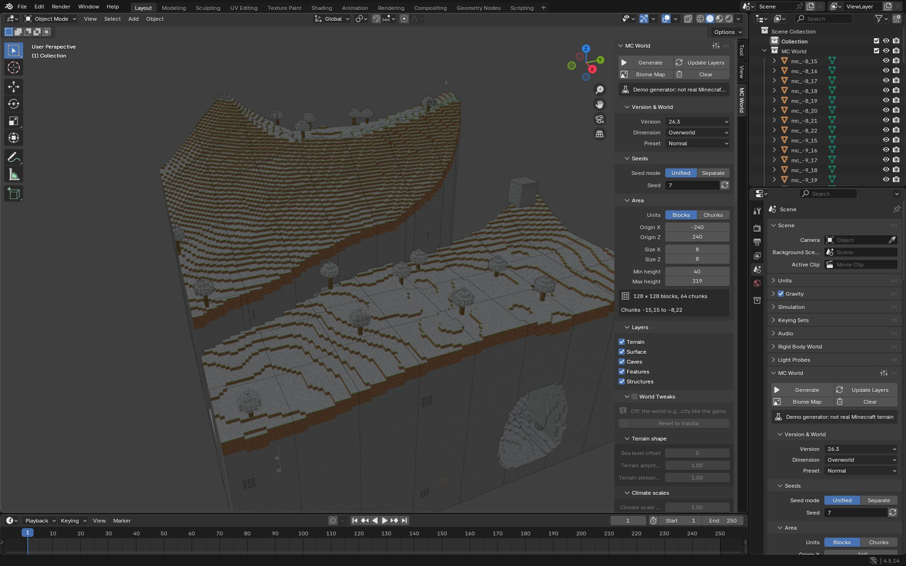
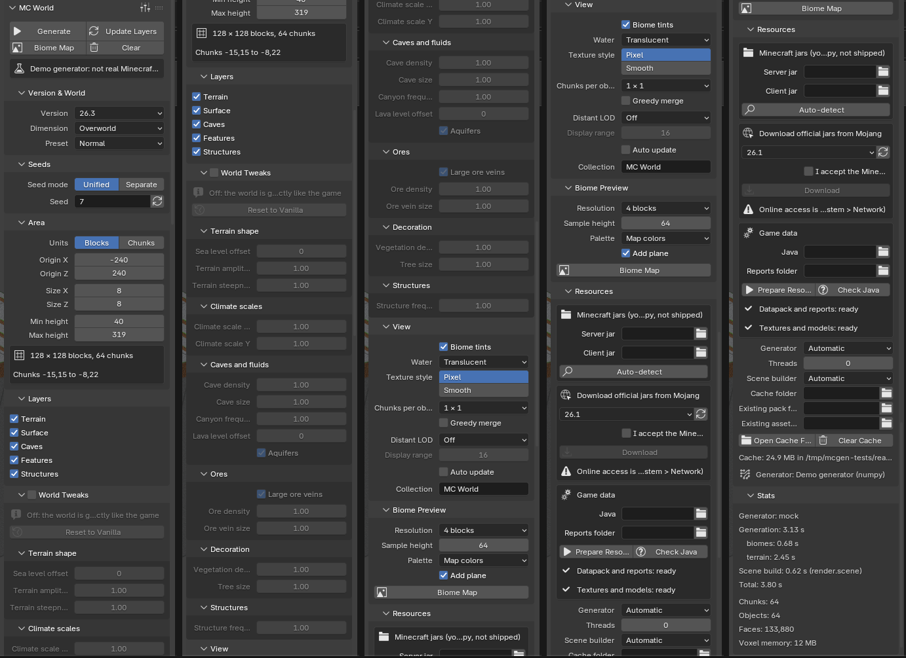
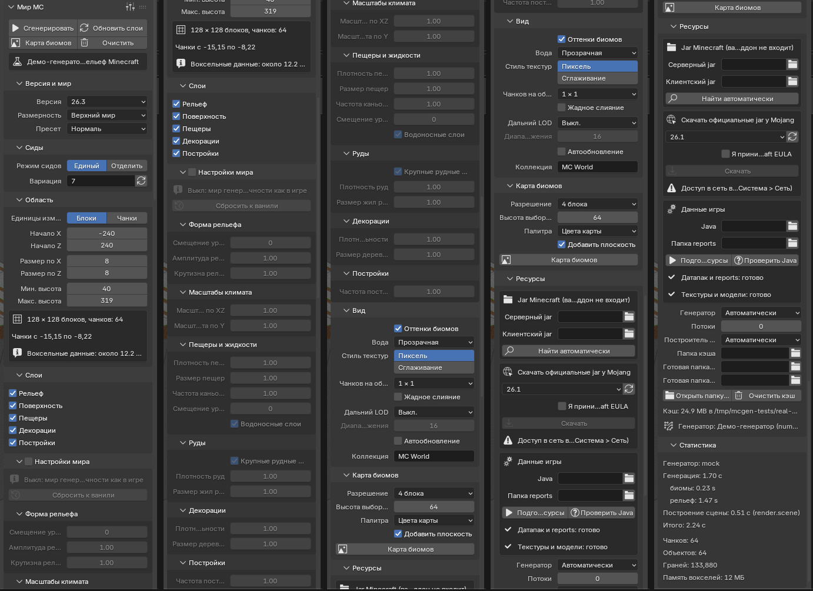

# Аддон Blender «MC Worldgen»: каркас, интерфейс, мост, сборка (поток W5)

Статус на 2026-10-02: **M1–M5 выполнены.** Аддон работает на макете, на заглушке библиотеки и на настоящей `libmcgen` потока W1; собирается в расширения по 4 платформам; расширение ставится в чистый профиль Blender 4.5.14 LTS и 5.2.2 LTS, `extension validate` проходит, тесты внутри установленного расширения проходят. Все числа ниже измерены (команды приведены). Что не сделано или не проверено — сказано прямо (разделы 12–14).

## 1. Итог по вехам

| Веха | Что сделано | Где |
|---|---|---|
| M1 мост и макет | `ctypes`-обёртка над `mcgen.h` (McGen/McWorld/McRegion, numpy-представления без копий, прогресс/отмена, ошибки, поиск библиотеки по платформе); макет той же поверхности на numpy; переключение одной строкой | `core/lib.py`, `core/mock.py`, `core/backend.py` |
| M2 ресурсы пользователя | выбор и автопоиск jar, скачивание у Mojang (только с принятой EULA), датапак и клиентские ресурсы в кэш, `reports/blocks.json` генератором данных игры на Java 25 (или готовая папка reports), кэш по sha1 | `core/pack.py` |
| M3 интерфейс | Scene → «MC World» + копия в боковой панели `N`; 9 подпанелей и 6 групп тонких настроек, строящихся из `libmcgen/tweaks.json` на лету; пресеты; Generate (modal, статус-бар, Esc), Update Layers, Biome Map, Prepare Resources, Clear; настройки в `Scene` (.blend); английский интерфейс и полный русский перевод | `ui/`, `core/jobs.py`, `core/fallback_preview.py` |
| M4 сборка | кросс-сборка `libmcgen` zig под 4 платформы с проверкой экспорта; расширения по платформам, `extension validate`, установка в чистый профиль, тесты внутри установленного расширения | `libmcgen/build.py`, `tools/build_extension.py`, `blender_manifest.toml` |
| M5 настоящая библиотека | мост работает на настоящей `libmcgen` без правок; 20 контрактных тестов; замер скорости; Generate/Update/Biome Map проверены на настоящих данных и на настоящем `SceneBuilder` W4 | `test_core.py::RealLibraryTests`, `blender_tests.py` |

Скриншоты настоящего GUI Blender 4.5 (Xvfb; демо-генератор + настоящий `SceneBuilder` W4; снимки сделаны до переименования двух подписей — «Seed» → «World seed», «Normal» → «Default»): боковая панель `N` с миром [`addon-viewport-en.jpg`](img/addon-viewport-en.jpg), все панели [`addon-panels-en.png`](img/addon-panels-en.png) и [`addon-panels-ru.png`](img/addon-panels-ru.png), модальная генерация с прогрессом [`addon-progress-en.jpg`](img/addon-progress-en.jpg), карта биомов [`addon-biomemap-en.jpg`](img/addon-biomemap-en.jpg), широкий редактор свойств [`addon-properties-en.jpg`](img/addon-properties-en.jpg) (и `*-ru.*`).







## 2. Раскладка файлов (зона W5)

```
blender/mcgen_addon/
  blender_manifest.toml   id mcgen, add-on, 4.2.0+, SPDX:MIT, permissions files+network, platforms ×4
  __init__.py             register/unregister (bpy только внутри Blender: ядро тестируется обычным python3)
  core/ (без bpy)         lib.py мост ctypes · mock.py макет · backend.py выбор lib/mock · pack.py ресурсы пользователя · tasks.py потоки
                          jobs.py Generate/Update/Biome Map · params.py GenParams и «что изменилось» · seeds.py · biomes.py + png.py
                          catalog.py списки версий/измерений/пресетов · sysinfo.py память · scene_iface.py SceneSink
                          fallback_preview.py запасной предпросмотр · w4_adapter.py адаптер SceneBuilder W4 · coords.py · tweaks.json (копия)
  ui/                     props.py · panels.py · ops.py · presets.py · translations.py (ru_RU) · i18n.py
  presets/mcgen/*.py      7 готовых пресетов
  lib/<платформа>/        libmcgen.so | mcgen.dll | libmcgen.dylib (бинарники в git не входят, есть .gitignore)
blender/tests/addon/      test_core.py · blender_tests.py · run_tests.py · stub/mcgen_stub.c · extract_strings.py · _boot.py
libmcgen/build.py · gen_tweaks.py · tweaks.json · gen/mcgen_tweaks_table.h        tools/build_extension.py
```

## 3. Мост ctypes и макет (M1)

```python
from mcgen_addon.core import backend
g = backend.open_gen(pack_dir, '26.3')                      # McGen (кэшируется: неизменяем, потокобезопасен)
g.dimensions(); g.presets(dim); g.block_names(); g.biome_names(); g.tweaks()
w = g.world('minecraft:overworld', 'normal', (climate, terrain, structures, features), {'cave_density': 1.5})
r = w.generate_region(cx0, cz0, nx, nz, stages=63, threads=0, progress=lambda frac, what: cancel_flag)
r.blocks(cx, cz)   # numpy u16 (height,16,16) [y][z][x] — view на память региона, БЕЗ копирования, изменяемый
r.biomes(cx, cz)   # u8 (height/4,4,4);  r.heightmap(cx, cz, kind) # i16 (16,16);  w.biome_grid(x0,z0,nx,nz,step,y) # u8 (nz,nx)
```

* Массивы — `np.frombuffer` поверх ctypes-массива по адресу из `mcgen_region_*`; ctypes-массив держит ссылку на регион, память живёт, пока жив любой массив (тест: запись через numpy видна в регионе, `np.shares_memory`).
* Вызовы через `CDLL` — GIL отпускается: генерация идёт в рабочем потоке Python (тест: поток-счётчик работает во время 0,2 с «вычислений» в C).
* Callback прогресса `(frac, what) → truthy = отмена`; исключение внутри callback не пересекает границу C: запоминается, генерация отменяется, исключение пробрасывается после возврата. Отмена → `McCancelled`. Ошибки: код `MCGEN_E_*` + текст из `err[]`.
* Поиск библиотеки: `lib/<платформа>/` аддона (`windows-x64`, `linux-x64`, `macos-arm64`, `macos-x64`), при запуске из исходников — `libmcgen/build/<платформа>/`, `libmcgen/build/`; `MCGEN_LIB=<файл>` — явный путь (только он).
* **Макет** (`core/mock.py`): шумовой рельеф, биомы по климату (67 имён), стадии `BIOMES<TERRAIN<SURFACE<CARVERS<FEATURES<STRUCTURES` с теми же масками, пещеры, руды, деревья без швов на границах чанков, «постройки», три измерения, пресеты `normal/large_biomes/amplified` и **те же тонкие настройки** из `tweaks.json` (ползунки живые). Блоки берёт из `reports/blocks.json` (те же id, поэтому сцена показывается настоящими текстурами). Это НЕ Minecraft — только для разработки интерфейса и демо.
* **Переключение mock → библиотека — одна строка** в `core/backend.py`: `BACKEND = 'auto'` (`'lib'` / `'mock'`); перекрывается `MCGEN_BACKEND` и выбором «Generator» в настройках аддона. `auto`: настоящая библиотека, если найдена и ABI подходит, иначе макет (в панели плашка «Demo generator»).
* **Заглушка** `tests/addon/stub/mcgen_stub.c` — полный ABI `mcgen.h` с плоским миром, настоящей таблицей настроек (из `libmcgen/gen/mcgen_tweaks_table.h`), прогрессом/отменой и дампом MCR1; проверяет мост и кросс-сборку независимо от W1.

## 4. Ресурсы пользователя (M2)

Формат каталогов — тот же, что у `tools/make_pack.py` (`pack-<V>/{data,reports,version.json}`, `assets-<V>/assets/minecraft/{blockstates,models,textures,atlases,items,lang/en_us}`), так что W1 и W4 читают их без изменений. Кэш — `bpy.utils.extension_path_user(…, 'cache')`, вне Blender `~/.cache/mcgen`.

* **Jar'ы**: `inspect_jar` определяет вид (сервер = bundler с `META-INF/versions.list`, клиент = `assets/minecraft/lang/en_us.json`), версию, `world_version`, нужную Java. «Auto-detect»: `.minecraft/versions/<v>/<v>.jar` (Linux, macOS, Windows, Flatpak), серверные jar в `.minecraft`, `Downloads`, `Desktop`, кэше; выбирается пара одной версии.
* **Скачивание**: манифест `piston-meta.mojang.com` → метаданные → `server.jar`/`client.jar` с проверкой sha1 и размера (`.part` → rename). **Без принятой EULA не качает** (галка «I accept the Minecraft EULA» по умолчанию выключена); оператор проверяет `bpy.app.online_access` и объясняет, где включить сеть; допустимы только http/https. В манифесте `permissions.network` и `permissions.files`.
* **Подготовка** (поток, прогресс, отмена): sha1 → датапак из внутреннего jar bundler'а → `reports/` → клиентские ресурсы; каждый шаг пропускается, если есть в кэше (каталог `<версия>-<sha1[:10]>`, атомарная запись, `.complete`).
* **reports/blocks.json**: `java -DbundlerMainClass=net.minecraft.data.Main -jar server.jar --reports --output …` в рабочем каталоге внутри кэша. Java ≥ версии из `version.json` (для 26.x — 25) ищется: поле «Java», `JAVA_HOME`, `PATH`, `/usr/lib/jvm`, `~/.sdkman`, рантаймы лаунчера `.minecraft/runtime/*/*/*/bin/java` (все ОС, включая Microsoft Store), `Program Files\Java|Eclipse Adoptium|…`, `/Library/Java/JavaVirtualMachines`. **Нет Java → понятное сообщение** с командой ручного запуска и запасным путём — поле «Reports folder» (папка `reports` или её родитель).
* «Existing pack/assets folder» (дополнительно) — использовать готовые каталоги вместо кэша.

Измерено на реальных jar 26.3 (Java 25.0.4): подготовка с нуля **15,0 с (повтор; первый прогон 25,6 с при загруженной машине)** (датапак 9885 файлов, reports, 11333 файла ресурсов), повторная — из кэша за <1 с; результат **побайтно совпадает с `tools/make_pack.py`** (`diff -rq` по `data/`, `reports/blocks.json`, `registries.json`, `assets/`); 35 723 состояния блоков.

## 5. Интерфейс (M3)

Python не умеет добавлять вкладки в редактор свойств, поэтому «вкладка» — верхняя панель **Scene → MC World** с подпанелями (как у Render properties) и копия в боковой панели `N` (вкладка «MC World»). Обе копии рисует один код (`ui/panels.py`); пресеты — в заголовке (`PresetPanel`, как у «Render → Format»).

| Подпанель | Содержимое |
|---|---|
| (верх) | **Generate**, **Update Layers**, **Biome Map**, **Clear**; во время работы — полоса прогресса + кнопка отмены; плашка «Demo generator», если нет настоящей библиотеки |
| Version & World | версия, измерение, пресет — списки из библиотеки (`mcgen_dimension_*`, `mcgen_preset_*` после открытия McGen, до того статические) |
| Seeds | единый / раздельные (climate, terrain, structures, features); число или текст как в игре (`Long.parseLong`, иначе `String.hashCode`; 25 векторов настоящей Java), пусто = случайный; кнопка «случайный» |
| Area | единицы блоки/чанки (начало пересчитывается при переключении), X/Z начала, размер `nx`/`nz` (ползунки `soft_max=64`, жёсткий предел 512), диапазон высот; «W × D блоков, N чанков», «Voxel data: около N МБ» |
| Layers | Terrain, Surface, Caves, Features, Structures (без рельефа остаются только биомы) |
| World Tweaks | галка «ваниль / настройки мира» + 6 сворачиваемых групп ползунков, **построенных из `libmcgen/tweaks.json` в рантайме** (`PropertyGroup` создаётся динамически); неприменимые к измерению — серые; «Reset to Vanilla» |
| View | оттенки биомов, вода, стиль текстур, чанков на объект 1/2/4/8, жадное слияние, дальний LOD и диапазон, автообновление, имя коллекции |
| Biome Preview | разрешение 1…32 блока/пиксель, высота выборки, палитра, «Add plane» |
| Resources | поля jar, Auto-detect, скачивание (список версий, галка EULA), Java, папка reports, Prepare Resources, статус кэша, «Generator: …» |
| Stats | генератор, время генерации (по стадиям), построение сцены, итого, чанков/объектов/граней, память вокселей |

Настройки хранятся в `Scene.mcgen` и сохраняются в .blend (тест: сиды, область, тонкие настройки, статистика, меши и упакованное изображение карты биомов переживают сохранение/открытие; воксели не сохраняются — Update Layers после открытия пересоздаёт всё). Пути к jar, Java, EULA, бэкенд — в настройках аддона (глобально). **Пресеты** (`AddPresetBase`): сохранить/загрузить/удалить; сохраняются все настройки сцены и все тонкие настройки, пути к jar — нет. Готовые: Vanilla Overworld 8x8, Large Biomes 16x16, Tall Mountains (tweaked), Swiss Cheese Caves (tweaked), Nether 8x8, The End 12x12, Split Seeds Demo. **Перевод**: подписи английские, `bpy.app.translations` для `ru_RU` даёт полный русский перевод (свойства, описания, enum, операторы, сообщения, статус-бар, ошибки ядра; тексты тонких настроек — поля `label_ru/description_ru` в `tweaks.json`). Покрытие проверяет AST-сбор всех строк (0 непереведённых) и тест в Blender, что перевод реально применяется. Динамические сообщения: исключения несут английский шаблон и параметры (`PackError(template, **kw)`), интерфейс переводит шаблон и подставляет параметры.

## 6. Операторы и фоновая работа

* Долгие операторы — «насосы»: `invoke()` запускает задачу в рабочем потоке (libmcgen через ctypes без GIL) и вешает `modal` с таймером 0,05 с; по таймеру — прогресс в статус-баре (`wm.progress_*` + `status_text_set`), **Esc отменяет** (флаг → callback библиотеки возвращает ≠0 → `MCGEN_E_CANCEL`), прочие события `PASS_THROUGH` (UI живой); сцена строится порциями по бюджету 30 мс/тик. `execute()` (скрипты, headless) делает то же синхронно.
* Проверено в настоящем GUI (Xvfb): полоса прогресса в панели и текст в статус-баре («MC World generate: terrain [52%]   Esc = cancel»), кнопки блокируются, **Esc реально отменил запущенную генерацию** (`job.state == 'cancelled'`), см. [`addon-progress-en.jpg`](img/addon-progress-en.jpg).
* **Generate**: пустые сиды заменяются случайными (и показываются); проверка ресурсов (настоящей библиотеке нужен pack; макету — нет); проверка памяти (воксели > 60 % ОЗУ → отказ; 512×512 чанков = 48,9 ГБ); поток: McGen → McWorld → `generate_region` с накоплением времени по стадиям → порционная сборка сцены.
* **Biome Map**: `mcgen_biome_grid` в потоке (по 256 строк, отмена между порциями), шаг автоматически растёт, если пикселей > 4096²; `Image` (упакован в .blend, `use_fake_user`) и по желанию плоскость (Emission, интерполяция Closest, север сверху). Палитры: цвета карты (таблица для 67 биомов), хэш имени, JSON биома (`water_color` океанов и рек, иначе `grass_color`/colormap `grass.png` по температуре и влажности; тест сверяет океан с `#3f76e4` из датапака).
* Остальное: Prepare Resources, Download, Refresh list, Auto-detect, Check Java, Clear Cache, Open Cache Folder, Random, Reset to Vanilla, Cancel.
* Очистка: `unregister` останавливает задачи, освобождает регионы и кэш McGen, снимает панели/свойства/пресеты/переводы/обработчик `load_post`; после выключения не остаётся ни одного класса `MCGEN_*`, `Scene.mcgen` и `bpy.ops.mcgen` (тест: три цикла включения/выключения).
* Совместимость: **Blender 4.5.14 LTS (Python 3.11, numpy 1.26)** и **5.2.2 LTS (Python 3.13, numpy 2.3)**. Прогона на 4.2 (минимум манифеста) нет — такого Blender в окружении нет; использованы только API, существующие в 4.2. Сторонних пакетов нет (stdlib + numpy Blender'а).

## 7. Update Layers: что именно пересчитывается

`core/params.py::diff` находит **нижнюю затронутую стадию** (`biomes<terrain<surface<carvers<features<structures`): сид climate → biomes, terrain → terrain, structures, features → свои; у каждой тонкой настройки в `tweaks.json` поле `stage`; смена слоёв → стадии изменённых флажков; версия/измерение/пресет → всё.

| Что изменилось | Действие |
|---|---|
| ничего | ничего, объекты те же |
| только настройки вида | библиотека не вызывается, сцена перестраивается из готового региона |
| мир / слои / область | `generate_region` (McWorld переиспользуется, если не менялись сиды/настройки/пресет); новые и прежние массивы блоков/биомов **сравниваются по чанкам**, пересобираются только изменившиеся чанки и их 8 соседей (границы без швов) |

Ограничение ABI: `mcgen_generate_region` не умеет «досчитывать» стадии поверх готового региона, поэтому библиотека пересчитывает область целиком; экономия — на построении сцены. Запрос к W1 — раздел 12. Тесты: `test_update_rebuilds_only_changed_chunks` (пересобраны ровно изменившиеся + соседи, остальные объекты те же), `…noop_and_view_only`, `…layers_toggle`, `…area_change…`.

## 8. Интеграция с W4 (меши)

Приёмник сцены `SceneSink` (`begin / step(бюджет) / stats / clear`). Выбор: `render.scene.SceneBuilder` потока W4 (если есть и ресурсы клиента готовы), иначе запасной `fallback_preview.PreviewSink` («блочный ландшафт» по карте высот: верх колонки + стенки, цвет по имени верхнего блока + оттенок биома из JSON). Адаптер `core/w4_adapter.py` (контракт — `docs/blender/assets-mesh.md` §1.2): `ViewSettings` из настроек, массивы чанков без копий, имена из библиотеки, диапазон высот = замена блоков вне диапазона воздухом. `SceneBuilder.build()` блокирующий, поэтому адаптер использует порционную форму: `build_iter` → `begin/step` → пачки `update_chunks` по группам (работает с текущим кодом W4: `update_chunks` создаёт недостающие группы; использует `_ensure_resources`/`set_chunks`) → блокирующий `build`. Update Layers с прежним построителем пересобирает только изменившиеся группы. Проверено: контрактные тесты на фиктивном `render.scene` (блокирующая и итераторная формы) и **настоящий SceneBuilder** (скриншоты; замеры раздела 11). Координаты: Blender = (x, −z, y), начало сцены — угол области (`core/coords.py`, смещение в `collection['mcgen_cx0','mcgen_cz0','mcgen_min_y']`).

## 9. Сборка и упаковка (M4)

**`libmcgen/build.py`** — `zig cc` 0.16.0, все `libmcgen/src/**/*.c` (включая `src/mesh/*.c`; `engine/` — заголовками):

```
python3 libmcgen/build.py [--targets linux-x64,…] [--cli]      # -> libmcgen/build/<платформа>/ и blender/mcgen_addon/lib/<платформа>/
python3 libmcgen/build.py --stub --out DIR --no-install        # отладка на заглушке (не libmcgen/src)
python3 libmcgen/build.py --src КОПИЯ_src …                    # проверка патча чужих исходников без правки
python3 libmcgen/build.py --check-exports файл                 # экспорт: ELF .dynsym / PE export dir / Mach-O nlist
```

Флаги: `-O2 -ffp-contract=off -fno-fast-math -std=gnu11 -fPIC -fvisibility=hidden -shared -s`; цели `x86_64-windows-gnu`, `x86_64-linux-gnu.2.28`, `aarch64-macos.11.0`, `x86_64-macos.11.0`. **Экспорт проверяется по собранному файлу**: наружу только `mcgen_*`/`mcmesh_*`, все функции `mcgen.h` обязаны присутствовать.

Результат `python3 libmcgen/build.py --cli` на текущих исходниках W1 (17 файлов `.c`, включая `mesh/mesh.c`), размеры после `-s`:

| Платформа | Файл | Размер | Экспорт `mcgen_*/mcmesh_*` | Сборка |
|---|---|---|---|---|
| linux-x64 | `libmcgen.so` | 303 КБ | 41, чужих нет, все функции `mcgen.h` | OK (+ `mcgen-cli`) |
| macos-arm64 | `libmcgen.dylib` | 286 КБ | 41 | OK |
| macos-x64 | `libmcgen.dylib` | 292 КБ | 41 | OK |
| windows-x64 | `mcgen.dll` | 356 КБ | 41 | **ошибка в `libmcgen/src/util.c`** (п. 12.1); из патченой копии (`--src`) собирается OK |

На заглушке (`--stub`) все 4 платформы собираются и проходят проверку экспорта (29 функций). Разборщики экспорта сверены с `nm -D` и `objdump -p`.

**`tools/build_extension.py`** — отдельный стейджинг на платформу (исходники аддона + `lib/<платформа>/` только этой платформы, `platforms = ["<платформа>"]`; тесты, `__pycache__`, `dev/` исключены) → `blender --command extension build --output-filepath …` → `extension validate`; контроль «в zip нет файлов Mojang»; `--test 4.5,5.2` ставит zip `extension install-file -r user_default -e` в **чистый профиль** (`BLENDER_USER_RESOURCES`) и прогоняет `blender_tests.py` внутри установленного `bl_ext.user_default.mcgen`. Встроенный `--split-platforms` Blender тоже работает (`mcgen-0.1.0-linux_x64.zip`, …), но кладёт все `lib/*` в каждый zip. Манифест: `schema_version 1.0.0`, `id mcgen`, `type add-on`, `blender_version_min 4.2.0`, `license SPDX:MIT`, `permissions`: `files` («Read your Minecraft jars and keep a cache of unpacked game data»), `network` («Optional: download the official Minecraft jars from Mojang»).

Результат `python3 tools/build_extension.py --platforms all --test 4.5,5.2 --backend lib` (в каждом zip лежит настоящая `libmcgen` своей платформы; Windows — из патченой копии):

| Платформа | Файл | Размер | Файлов | `extension validate` (4.5.14 и 5.2.2) |
|---|---|---|---|---|
| windows-x64 | `blender/dist/mcgen-0.1.0-windows-x64.zip` | 369 КБ | 60 | OK |
| linux-x64 | `mcgen-0.1.0-linux-x64.zip` | 334 КБ | 60 | OK |
| macos-arm64 | `mcgen-0.1.0-macos-arm64.zip` | 317 КБ | 60 | OK |
| macos-x64 | `mcgen-0.1.0-macos-x64.zip` | 326 КБ | 60 | OK |

Установка linux-x64 в **чистый профиль** (`extension install-file -r user_default -e`) и 48 тестов внутри установленного расширения с настоящей библиотекой из `lib/linux-x64/`: Blender 4.5.14 — 48 тестов, 0 ошибок (3 пропуска: проверки содержимого мира макета); Blender 5.2.2 — то же. В zip нет файлов Mojang (проверяется сборщиком).

## 10. Тесты и результаты

Команда: `python3 blender/tests/addon/run_tests.py` (ядро + Blender 4.5 и 5.2 × макет / заглушка / настоящая библиотека). Ядро отдельно: `python3 blender/tests/addon/test_core.py`.

| Прогон | Тестов | Результат | Время |
|---|---|---|---|
| ядро, python 3.12 (`test_core.py`: макет, заглушка, 20 тестов настоящей библиотеки, ресурсы на реальных jar) | 85 | OK | 69 с |
| Blender 4.5.14 LTS (Py 3.11) / макет | 48 | OK | 19 с |
| Blender 4.5.14 / заглушка библиотеки (3 пропуска: содержимое мира) | 48 | OK | 3 с |
| Blender 4.5.14 / **настоящая libmcgen** (3 пропуска: содержимое мира макета) | 48 | OK | 9 с |
| Blender 5.2.2 LTS (Py 3.13) / макет | 48 | OK | 23 с |
| Blender 5.2.2 / заглушка | 48 | OK | 2 с |
| Blender 5.2.2 / **настоящая libmcgen** | 48 | OK | 7 с |
| установленное расширение, чистый профиль, 4.5.14 и 5.2.2, настоящая libmcgen | 48 + 48 | OK | — |

Что покрыто. **Ядро**: сиды (25 векторов настоящей Java), параметры и диффы, таблица настроек (JSON валиден, копии синхронны, умолчания = ваниль, ru-тексты), макет (формы, детерминизм, независимость доменов сидов, стадии, настройки меняют мир, 3 измерения, отмена), мост на заглушке (структуры ctypes, реестры, таблица настроек = JSON через настоящий C-заголовок, ошибки с текстом, zero-copy, стадии, прогресс/отмена, GIL, дамп MCR1, переключение бэкенда), ресурсы (синтетические jar без Java и сети: скачивание с локального «piston-meta» с sha1, EULA, схема URL, Auto-detect, нет Java → сообщение, версии/мусорные jar, отмена; реальные jar: побайтное совпадение с `make_pack.py`, кэш по sha1), палитры, PNG, память. **Blender**: регистрация, расположение панелей, свойства и пределы ползунков, динамические настройки, enum, сиды, единицы, отрисовка **всех** классов панелей «записывающим» layout (каждое свойство, оператор и значок существует), Generate/Update/Clear/Biome Map/Prepare/Detect/Download-отказ на всех бэкендах, адаптер W4, пресеты (применить все готовые, сохранить/загрузить/удалить), перевод ru_RU, сохранение .blend, выключение/включение.

**Контрактные проверки настоящей `libmcgen` (M5)** — `RealLibraryTests`, 20 тестов (нереализованное пропускается, расхождение — провал): ABI; все функции `mcgen.h` экспортированы; реестры (3 измерения, пресеты, 35 723 состояния, 67 биомов); **имена состояний совпадают с `reports/blocks.json` для всех 35 723** (формат и порядок свойств); таблица настроек = `tweaks.json`; размеры миров по измерениям; ошибки; `biome_at` = `biome_grid`; форма/dtype массивов; **карта высот WORLD_SURFACE согласована с блоками**; независимость доменов сидов (features/structures не меняют рельеф, terrain меняет, climate меняет биомы); единый сид = 4 равных; результат не зависит от числа потоков и формы региона; одновременная генерация из 4 потоков Python; отмена; дамп MCR1; рост RSS за 25 регионов — 0 МБ.

## 11. Скорость

Измерено на 12 ядрах (WSL2, машина разделена с другими потоками работ — числа плавают до ×2), настоящая `libmcgen` (`libmcgen/build/libmcgen.so`, W1), область 256 чанков (16×16), сид 12345, Overworld:

| Операция (`RealLibraryTests.test_performance`) | Результат |
|---|---|
| только биомы, 1 поток / авто | 351 / 2201 чанков/с |
| заполнение шумом (TERRAIN), 1 поток / авто | 65 / 183 чанков/с |
| все стадии (сейчас = терраин + то, что реализовано), 1 поток / авто | 65 / 172 чанков/с |
| `mcgen_open` (датапак + реестры 26.3) / `mcgen_world_new` | 0,29 с / 1 мс |
| `mcgen_biome_grid` 1024×1024 точек, шаг 4 (один поток) | 11,1 с |

Из аддона (Blender 4.5, headless, `generate` через `bpy.ops` в рабочем потоке + настоящий `SceneBuilder` W4, настоящая библиотека, слои Terrain+Surface):

| Область | Генерация (ctypes) | Построение сцены | Всего | Объектов / граней | Update Layers (смена `sea_level_offset`, все чанки затронуты) |
|---|---|---|---|---|---|
| 16×16 чанков (256) | 2,3 с | 24,4 с (первый запуск: строится таблица состояний/атлас W4) | 27,1 с | 256 / 0,91 М | 8,4 с (генерация 1,4 + сцена 6,9) |
| 32×32 чанков (1024) | 5,3 с | 25,8 с | 31,6 с | 1024 / 3,0 М | 24,8 с |
| 32×32, запасной предпросмотр | 5,0 с | 4,5 с | 9,8 с | 1024 / 0,35 М | — |
| Biome Map 32×32 чанков (шаг 4) | 0,25 с | — | — | изображение 128×128 | — |

Ворота G7 («сцена 32×32 чанков < 60 с на 12 потоках») на текущих слоях выполняются: 31,6 с; в более спокойный момент тот же прогон давал 15,7 с (генерация 4,5 + сцена 10,7). Макет: ≈30 мс на чанк в одном потоке (64 чанка — 1,9 с). Интерфейс не блокируется: генерация идёт в потоке, сцена — порциями по 30 мс на тик таймера (проверено в GUI, раздел 6). Построение сцены W4 в этом режиме идёт в главном потоке по одному чанку на порцию (`update_chunks`) — просим `build_iter` (раздел 12).

## 12. Расхождения контрактов и запросы к другим потокам

**Для W1 (libmcgen):**
1. **Windows-сборка падает**: `libmcgen/src/util.c:145` — `_create_locale`/`LC_NUMERIC` не объявлены (`#include <locale.h>` стоит только в ветке не-Windows). Проверено: с `#include <locale.h>` в начале файла DLL собирается (`build.py --src <копия> --targets windows-x64`: `mcgen.dll`, 41 экспорт, все функции `mcgen.h`). Пакет Windows в этом отчёте собран из такой патченой копии; в `libmcgen/src` правка не внесена (чужая зона).
2. `mcgen_biome_grid` однопоточна: 1024×1024 точек за 11,1 с (≈ 10 мкс на точку). Для «Biome Map» больших областей нужен параллелизм внутри вызова.
3. Callback прогресса отдаёт `what = "chunks"` для всей генерации, поэтому «время по стадиям» в Stats — одна строка. Желательно `what` = имя стадии.
4. **Нет инкрементального API**: для Update Layers нужен `mcgen_region_extend(region, stages)` (досчитать стадии поверх готового региона) или кэш промежуточных результатов.
5. Косметика: `mcgen.h:8` содержит `/**` внутри комментария (`-Wcomment`).
6. W1 добавил настройку `aquifers` в `tweaks.json` — аддон подхватил автоматически (ползунки строятся из файла; `gen_tweaks.py --check` проходит).

**Для W4:** (а) `SceneBuilder` без порционной формы — просим `build_iter(...)` либо `begin()/step(бюджет)->bool` и публичный `prepare(block_names, biome_names)` вместо приватных `_ensure_resources/set_chunks`; (б) в `ViewSettings` нет `water_style`, `tint_biomes` и диапазона высот — адаптер их передаёт (игнорируются), срез делается заменой блоков воздухом; (в) `chunks_per_object`, `merge_flat`, `lod` подхвачены; (г) при запуске из исходников через symlink `mesher._repo_root()` не находит `libmcgen/src/mesh/mesh.c` — в расширении не проявляется (`mcmesh_*` экспортируются из `lib/<платформа>/libmcgen.*`).

**Для координатора:** `mcgen.h` менять не потребовалось (блоки `u16`, биомы `u8`, высоты `i16` — как в заголовке, расхождений нет). Новое между потоками: `libmcgen/tweaks.json` (+ `gen_tweaks.py`, `libmcgen/gen/mcgen_tweaks_table.h`) — единственный источник тонких настроек; `core/tweaks.json` в аддоне — генерируемая копия.

## 13. Принятые решения

* Вкладка = панель Scene → «MC World» (+ боковая `N`): Blender не допускает новых вкладок из Python.
* Размер области всегда в чанках; единицы блоки/чанки переключают только начало (при блоках — округление вниз до сетки чанков). Диапазон высот — срез отображения; библиотека строит полную колонку.
* По умолчанию Terrain/Surface/Caves включены, Features/Structures выключены. Сид по умолчанию `12345`; пустое поле = случайный, как в игре.
* Тонкие настройки: список, диапазоны, ru-тексты и «нижняя стадия» — в `tweaks.json`; умолчания нейтральны (множители 1, смещения 0), режим «ваниль» не передаёт настройки библиотеке вовсе.
* `auto` выбирает настоящую библиотеку, если она найдена; на макет переходит только при её отсутствии (ошибки времени выполнения библиотеки макетом не скрываются).
* Макет считает в одном потоке: numpy под GIL на мелких массивах с несколькими потоками медленнее (8×8 чанков: 1,8 с на 1 потоке против 4,7–7 с на 4–8).
* Ресурсы Mojang не поставляются; скачивание — только по явной галке EULA.

## 14. Не сделано

* Прогон на Blender 4.2 (нет в окружении), запуск на Windows/macOS (кросс-сборка есть, исполнение — нет); подписанные бинарники macOS; публикация на extensions.blender.org.
* Инкрементальное досчитывание стадий (нужен API, п. 12.4); построение мешей в рабочих потоках (зависит от W4); режимы воды/оттенков для W4-мешей.
* «Загрузить воксели» из дискового кэша по хэшу настроек (спека §3.5).
* Скриншоты сняты на демо-генераторе до двух переименований подписей (см. п. 1); снимка настоящей библиотеки в GUI нет (она проверена headless: раздел 11).
