# «MC Worldgen» для Blender — руководство пользователя

Аддон строит мир Minecraft 26.x (Верхний мир, Нижний мир, Энд) по seed **нашей собственной C-библиотекой `libmcgen`** и рисует его настоящими блоками из **вашего** клиентского jar: текстуры, формы, повороты, оттенки биомов. Мир — это данные (массивы блоков), а не миллионы объектов: на каждый чанк приходится один меш, а ставить и ломать блоки можно прямо в 3D-виде.

Все кадры ниже — настоящие рендеры аддона (Blender 4.5, EEVEE; полная генерация: рельеф, поверхность, пещеры, декорации, постройки). Точность генерации относительно настоящего сервера Minecraft и её ограничения — [`accuracy.md`](accuracy.md).

| | |
|---|---|
|  |  |
| деревня (`village_plains`): дома, дороги, колодец, грядки, стога | цветочный лес: берёзы, дубы, цветы, поляны |
| 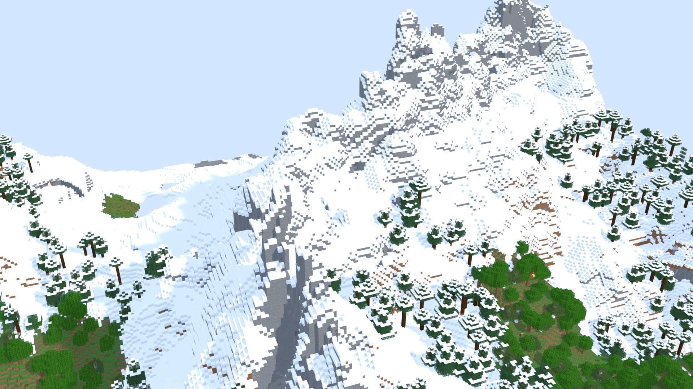 | 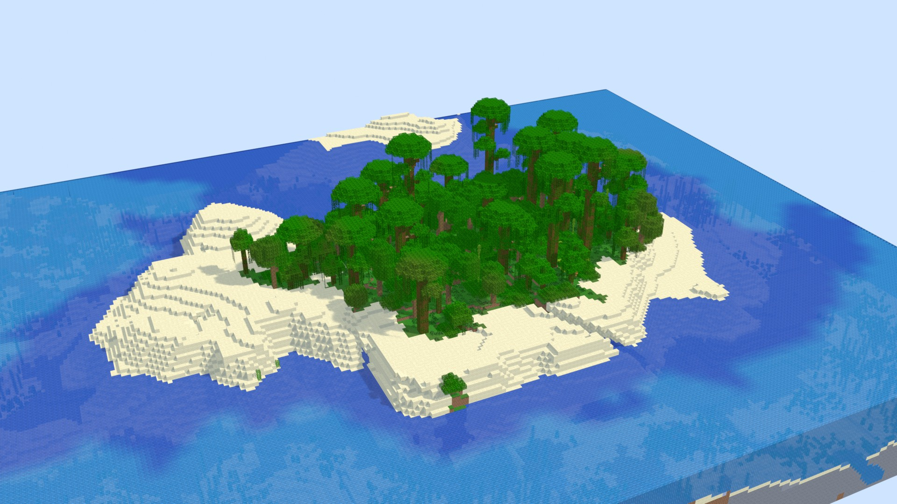 |
| снежная тайга и горные пики (`jagged_peaks`) | джунглевый остров с пляжем, полупрозрачная вода |
| 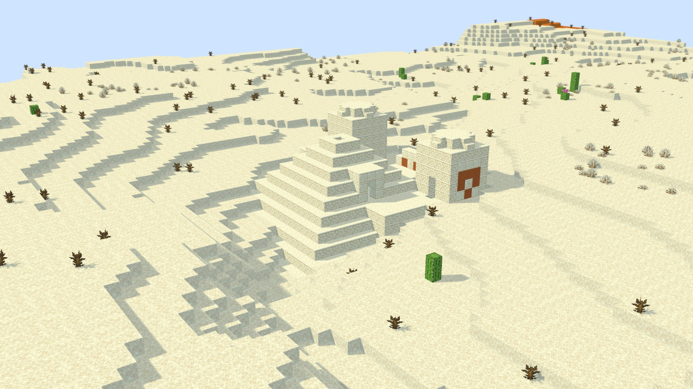 |  |
| пустынный храм | Нижний мир: крепость над лавовым морем (срез по y = 86) |
| 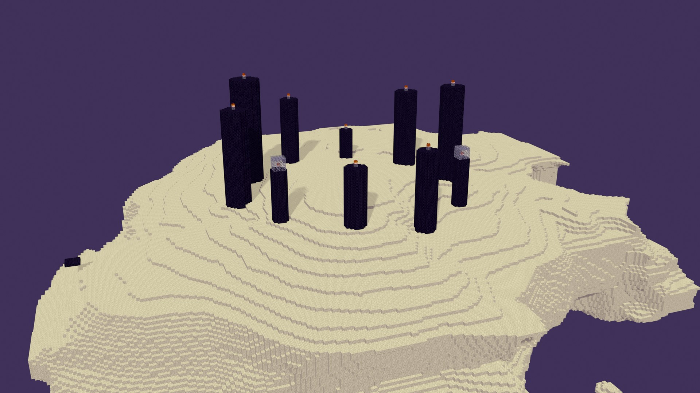 | |
| главный остров Энда с обсидиановыми шипами | |

## Оглавление

1. [Установка](#1-установка)
2. [Первый запуск: ресурсы игры](#2-первый-запуск-ресурсы-игры)
3. [Быстрый старт](#3-быстрый-старт)
4. [Панели и ползунки](#4-панели-и-ползунки)
5. [Карта биомов](#5-карта-биомов)
6. [Маркеры построек](#6-маркеры-построек)
7. [Строительство и разрушение](#7-строительство-и-разрушение)
8. [Сохранение .blend и «Загрузить воксели»](#8-сохранение-blend-и-загрузить-воксели)
9. [Производительность и память](#9-производительность-и-память)
10. [Частые проблемы](#10-частые-проблемы)
11. [Известные ограничения](#11-известные-ограничения)
12. [Правовая сторона](#12-правовая-сторона)

---

## 1. Установка

Нужен Blender **4.2 или новее** (проверено на 4.5.14 LTS и 5.2.2 LTS). Расширение — один zip на платформу:

| Платформа | Файл |
|---|---|
| Windows x64 | `mcgen-0.1.16-windows-x64.zip` |
| Linux x64 | `mcgen-0.1.16-linux-x64.zip` |
| macOS (Apple Silicon) | `mcgen-0.1.16-macos-arm64.zip` |
| macOS (Intel) | `mcgen-0.1.16-macos-x64.zip` |

Файлы собирает `python3 tools/build_extension.py` (каталог `blender/dist/`; библиотеки под все четыре платформы строятся кросс-компилятором zig: `python3 libmcgen/build.py`). В zip лежат только наш код и библиотека `libmcgen` — **ни одного файла Mojang** в нём нет.

1. В Blender: **Edit ▸ Preferences ▸ Get Extensions**.
2. В правом верхнем углу окна нажмите **стрелку выпадающего меню (∨) ▸ Install from Disk…** и выберите zip своей платформы (или просто перетащите zip в окно Blender).
3. Blender покажет запрашиваемые разрешения — **Files** (читать ваши jar игры и держать кэш распакованных данных) и **Network** (необязательно: скачивание jar у Mojang). Подтвердите.
4. Расширение «MC Worldgen» включается сразу; проверить можно в **Preferences ▸ Add-ons**.

Из командной строки (например, для сборочной машины): `blender --command extension install-file -r user_default -e mcgen-0.1.16-linux-x64.zip`.

Где искать интерфейс: **Properties editor ▸ вкладка Scene ▸ панель «MC World»** и та же панель в **боковой панели 3D-вида (клавиша `N`) ▸ вкладка «MC World»**. Вкладки в редакторе свойств Python добавлять не позволяет, поэтому «вкладка» — верхняя панель Scene с подпанелями, как у Render. Язык интерфейса — английский; при выборе русского языка Blender (**Preferences ▸ Interface ▸ Language**) аддон переводится целиком (включая подписи и описания всех ползунков).

> Windows и macOS-сборки проверены только сборкой и проверкой экспорта функций (запускались Linux-версии на Blender 4.5.14 и 5.2.2) — см. [§11](#11-известные-ограничения).

## 2. Первый запуск: ресурсы игры

Аддон **ничего не поставляет из игры**: данные мира (датапак), список блоков, модели и текстуры он берёт из jar-файлов, которые принадлежат вам. Нужно один раз «подготовить ресурсы» для выбранной версии (26.1, 26.2, 26.3 или 26.4-snapshot-2).

Откройте панель **Resources** (в Scene ▸ MC World или в настройках аддона: Preferences ▸ Add-ons ▸ MC Worldgen).

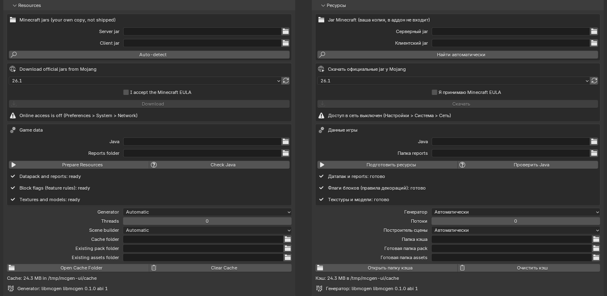

**Шаг 1 — jar-файлы.** Нужна пара файлов **одной версии**:

* **Server jar** — `server.jar` с minecraft.net (или из лаунчера); из него берутся датапак мира и таблица состояний блоков;
* **Client jar** — `.minecraft/versions/<версия>/<версия>.jar`; из него берутся текстуры, модели и blockstates.

Три способа:

* **Auto-detect** — аддон ищет клиентские jar в `.minecraft/versions/<версия>/` (Linux, macOS, Windows, Flatpak) и в библиотеках **Prism / PolyMC / MultiMC / Modrinth App**, серверные — в `.minecraft`, `Downloads`, `Desktop` и в своём кэше, и выбирает пару одной версии (подробности — [§2.1](#21-свои-jar-официальный-лаунчер-multimc--prism-modrinth));
* вручную — выберите файлы в полях Server jar / Client jar;
* **Download official jars from Mojang** — выберите версию, поставьте галку **«I accept the Minecraft EULA»** (по умолчанию она выключена; без неё аддон ничего не качает; см. [§12](#12-правовая-сторона)) и нажмите **Download**. Для этого в Blender должен быть разрешён доступ в сеть: **Preferences ▸ System ▸ Network ▸ Allow Online Access** (панель сама подскажет, если он выключен). Файлы проверяются по sha1 из манифеста Mojang.

**Шаг 2 — Java 25.** Часть данных (`reports/blocks.json` — список всех состояний блоков и их свойств) выдаёт сам генератор данных игры, а он требует **Java 25 или новее** (достаточно JRE). Аддон ищет её сам: поле **Java**, переменная `JAVA_HOME`, `PATH`, `/usr/lib/jvm`, SDKMAN, `Program Files\Java|Eclipse Adoptium`, `/Library/Java/JavaVirtualMachines` и **встроенную среду лаунчера** (`.minecraft/runtime/…`, в том числе у Microsoft Store). Кнопка **Check Java** показывает, что найдено. Если Java нет — аддон скажет об этом и подскажет команду для ручного запуска; запасной путь — поле **Reports folder** (папка `reports` или её родитель, где уже лежит `blocks.json`, полученный кем-то другим тем же способом).

**Шаг 3 — Prepare Resources.** Кнопка распаковывает датапак и клиентские ресурсы в кэш аддона, запускает Java для `reports/blocks.json` и выводит «правила декораций» (`block_flags.json`; для этого используется **наш** маленький класс, код Mojang в нём не нужен, JDK тоже: хватает JRE 25). Идёт в фоне, есть прогресс и отмена; результат кэшируется по sha1 jar, повторная подготовка занимает меньше секунды. В панели появятся три галки «ready»: *Datapack and reports*, *Block flags*, *Textures and models*. Время и размер кэша — в [§9](#9-производительность-и-память).

Кэш лежит в каталоге пользователя расширения Blender (`extension_path_user(..., 'cache')`); сменить место можно в поле **Cache folder**, открыть — кнопкой **Open Cache Folder**, удалить — **Clear Cache**. Если у вас уже есть готовые каталоги (`tools/make_pack.py`), укажите их в **Existing pack / assets folder**.

### 2.1. Свои jar: официальный лаунчер, MultiMC / Prism, Modrinth

Аддон работает с **любыми jar Mojang нужной версии** — откуда вы их взяли, не важно. Узнать «нужный» jar можно по `version.json` внутри (аддон читает его сам и показывает версию в панели); пара *server + client* должна быть **одной версии**.

**Что откуда берётся**

| Что нужно | Где лежит | Что аддон из него берёт |
|---|---|---|
| **Client jar** (`<версия>.jar`) | у любого лаунчера, в таблице ниже | текстуры, модели, blockstates; при отсутствии серверного jar — ещё и датапак |
| **Server jar** (`server.jar`) | **лаунчеры его не хранят**: только на [minecraft.net/download/server](https://www.minecraft.net/download/server) или кнопкой **Download** (с галкой EULA) | датапак мира и `reports/blocks.json` (список всех состояний блоков — его создаёт генератор данных игры, запускаемый из этого jar) |

Без серверного jar подготовить ресурсы всё равно можно, но тогда нужна готовая папка **Reports folder** (`blocks.json` и остальные файлы `reports`, полученные тем же генератором: `java -DbundlerMainClass=net.minecraft.data.Main -jar server.jar --reports --output out`). Проще всего один раз скачать серверный jar кнопкой Download.

**Где лежит client jar**

| Лаунчер | Windows | Linux | macOS |
|---|---|---|---|
| Официальный (Minecraft Launcher) | `%APPDATA%\.minecraft\versions\<версия>\<версия>.jar` | `~/.minecraft/versions/<версия>/<версия>.jar` | `~/Library/Application Support/minecraft/versions/<версия>/<версия>.jar` |
| **Prism Launcher** / PolyMC | `%APPDATA%\PrismLauncher\libraries\com\mojang\minecraft\<версия>\minecraft-<версия>-client.jar` | `~/.local/share/PrismLauncher/libraries/com/mojang/minecraft/<версия>/minecraft-<версия>-client.jar` (Flatpak: `~/.var/app/org.prismlauncher.PrismLauncher/data/PrismLauncher/…`) | `~/Library/Application Support/PrismLauncher/libraries/com/mojang/minecraft/…` |
| **MultiMC** (портативный: каталог, куда вы его распаковали) | `<папка MultiMC>\libraries\com\mojang\minecraft\<версия>\minecraft-<версия>-client.jar` | то же | то же |
| **Modrinth App** | `%APPDATA%\ModrinthApp\meta\versions\<версия>\<версия>.jar` | `~/.local/share/ModrinthApp/meta/versions/<версия>/<версия>.jar` | `~/Library/Application Support/ModrinthApp/meta/versions/…` |

Версия сначала должна быть **запущена или установлена** в лаунчере (создана хотя бы одна копия игры), иначе jar там ещё нет. Prism/MultiMC хранят его не в папке копии игры (`instances/<имя>/.minecraft`), а в общих `libraries/`. Если не уверены, где каталог данных лаунчера: в Prism / PolyMC — кнопка **Folders ▸ View Launcher Root Folder**, у портативного MultiMC — папка, куда вы его распаковали; в ней откройте `libraries/com/mojang/minecraft/`.

**Как подключить**

1. **Auto-detect** — найдёт всё перечисленное в стандартных местах и выберет пару одной версии. Если найден только client jar, аддон так и скажет («серверного jar нет») — добавьте server jar кнопкой Download или с minecraft.net.
2. Не нашлось (портативный MultiMC, нестандартный диск, jar переименован) — в полях **Server jar** / **Client jar** нажмите значок папки и укажите файлы вручную. Имя файла значения не имеет: нужен только настоящий jar Mojang с `version.json` внутри (другие jar'ы, например модлоадеры или «обёрнутые» клиенты, аддон отклонит сообщением «does not look like a Mojang client/server jar»).
3. **Prepare Resources**. Аддон **копирует** из jar нужные ресурсы в свой кэш; сами ваши jar не изменяются, а при повторной подготовке (по sha1 файла) не перечитываются.

Моды в лаунчере не мешают: нужно лишь, чтобы там лежал чистый jar Mojang нужной версии. Jar'ы модлоадеров (Forge / Fabric / NeoForge) и «склеенные» сборки не подходят: аддон их отклонит сообщением «does not look like a Mojang client/server jar». Расположение файлов в Prism / MultiMC / Modrinth App проверено по устройству этих лаунчеров и на тестовых каталогах; если у вас другая раскладка, укажите jar вручную (шаг 2) — это работает всегда.

**Windows: Blender из Microsoft Store и длинные пути.** Здесь две отдельные беды.

* **Лимит 259 символов.** Windows по умолчанию не открывает файлы, путь к которым длиннее 259 символов, а датапак игры содержит имена до ~140 символов. Если свою **Cache folder** вы задаёте сами, держите путь коротким (например, `C:\mcgen`); слишком длинный путь аддон отклонит заранее понятной ошибкой, а не посреди распаковки.
* **Виртуализация AppData.** Blender из Microsoft Store — «упакованное» приложение: всё, что он пишет в `…\AppData\…`, на самом деле попадает в приватную папку `…\AppData\Local\Packages\BlenderFoundation.Blender_…\LocalCache\…`. Сам Blender свои файлы видит, а **внешние программы — нет**: Java (генератор данных игры) отвечает «Unable to access jarfile …», `cmd` — «`build_gpu.bat` не является внутренней или внешней командой», а в Проводнике «папки по этому пути нет». Аддон 0.1.3+ распознаёт такую установку и сам кладёт кэш в `%USERPROFILE%\.mcgen` (запасной вариант — `C:\mcgen`), причём проверяет это не догадкой, а пробным файлом, который читает дочерний процесс. Если вы указали **Cache folder** внутри AppData, аддон скажет об этом ошибкой и подскажет выход: папка вне AppData, например `C:\mcgen`. Версия Blender с blender.org (не из Store) этим не страдает.

Не-ASCII имена (кириллица в имени пользователя) библиотека открывает через «широкие» API Windows (UTF-8 → UTF-16); если с такими путями всё же что-то пойдёт не так, укажите Cache folder вида `C:\mcgen`.

## 3. Быстрый старт

1. Установите расширение, подготовьте ресурсы ([§1–2](#1-установка)).
2. В **Scene ▸ MC World** выберите версию, измерение, пресет; введите seed (число или любой текст; пусто — случайный).
3. В **Area** задайте начало и размер в чанках (для первого раза — 8×8 или 16×16).
4. Включите нужные **Layers** (для красивой картинки — все пять: Terrain, Surface, Caves, Features, Structures).
5. Нажмите **Generate**. Прогресс виден в панели и в статус-баре, **Esc** отменяет; интерфейс не замирает (генерация идёт в рабочем потоке, сцена строится порциями).

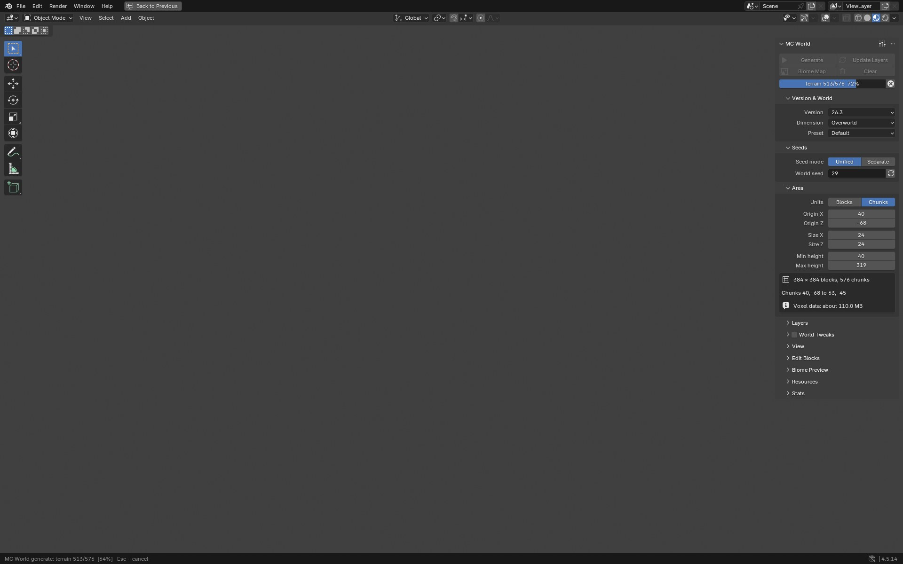

*Русская версия — [`ui-progress-ru.jpg`](img/ui-progress-ru.jpg).*

6. Крутите вид как обычно, переключитесь в **Material Preview** или **Rendered**, добавьте Sun-лампу — и рендерите. Для кадров из этого документа использовались EEVEE, солнце 3–4 Вт, мягкий свет неба и камера «диорамой» (скрипты — `blender/tests/showcase/`).

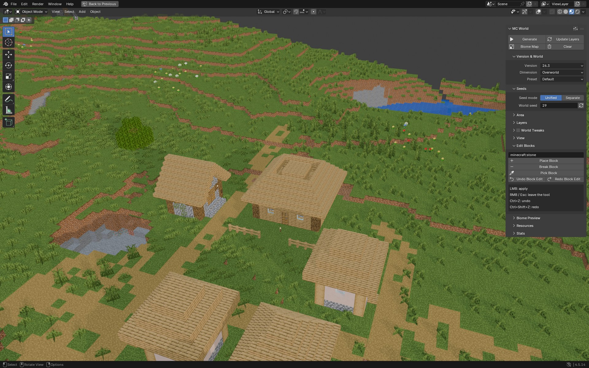

*Боковая панель `N` ▸ «MC World» рядом с построенным миром. Домик слева посередине построен инструментами из панели «Edit Blocks» ([§7](#7-строительство-и-разрушение)). Русская версия — [`ui-viewport-ru.jpg`](img/ui-viewport-ru.jpg).*

## 4. Панели и ползунки

Панели идут сверху вниз в том порядке, в каком вы с ними работаете. Подписи английские; русские — на втором кадре каждой пары.

### 4.1. Кнопки сверху и пресеты


* **Generate** — сгенерировать область заново (фоновый поток, статус-бар, **Esc** — отмена; прежняя сцена при отмене сохраняется).
* **Update Layers** — пересчитать **только то, что затронуто** изменёнными настройками, и перестроить только изменившиеся чанки. Менялись лишь настройки вида (вода, оттенки, LOD) — библиотека не вызывается вовсе, сцена строится из готовых данных. Менялся сид рельефа — пересчитывается рельеф и всё после него; сид построек или декораций — только они.
* **Biome Map** — быстрая карта биомов области ([§5](#5-карта-биомов)).
* **Clear** — убрать объекты аддона из сцены и освободить воксели (настройки остаются; сохранённые правки блоков тоже остаются в файле).
* Значок слева от `⋮⋮` в заголовке панели — **пресеты** настроек: *Vanilla Overworld 8x8*, *Large Biomes 16x16*, *Tall Mountains (tweaked)*, *Swiss Cheese Caves (tweaked)*, *Nether 8x8*, *The End 12x12*, *Split Seeds Demo*. Можно сохранять и свои (сохраняются все настройки сцены и все «настройки мира», но не пути к jar).
* Если библиотеки `libmcgen` для вашей платформы не нашлось, в панели появится плашка **«Demo generator»** — аддон работает на запасном макете (не Minecraft!). С настоящей библиотекой плашки нет.

### 4.2. Version & World (версия и мир)

* **Version** — 26.1 / 26.2 / 26.3 / 26.4-snapshot-2. Списки строятся из подготовленных данных; у каждой версии свой датапак (в 26.3 Mojang переписал шум на `float`, поэтому миры 26.3 численно отличаются от 26.1/26.2 — и аддон воспроизводит обе ветки бит-в-бит).
* **Dimension** — Overworld, Nether, The End.
* **Preset** — тип мира датапака: *Default*, *Amplified*, *Large Biomes*, *Single Biome Surface*, *Floating Islands*, *Caves* (набор берётся из датапака версии; в Нижнем мире и Энде — только Default).

### 4.3. Seeds (сиды)

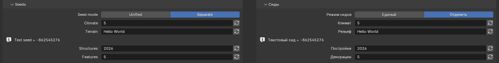

* **Unified** (по умолчанию) — один seed на всё, **ровно как в игре**: тот же мир, что вы получите, введя этот seed в Minecraft.
* **Separate** — четыре независимых сида, каждый отвечает за свою часть генерации:
  * **Climate** — шумы климата (температура, влажность, континентальность, эрозия, «странность»): определяют биомы и общую форму рельефа;
  * **Terrain** — все остальные именованные шумы: пещеры, водоносные слои, жилы руды, поверхность, полосы глины в пустошах;
  * **Structures** — размещение и устройство построек (деревни, храмы, шахты…);
  * **Features** — декорации: деревья, цветы, трава, рудные включения, озёра.
  Так можно, например, оставить рельеф и биомы, но перетасовать деревни и деревья, или наоборот.
* Поле принимает **число** или **любой текст** (как в игре: текст хэшируется `String.hashCode`, под полем показывается получившееся число — `Hello World` даёт `-862545276`). Пустое поле — случайный seed (он подставится и будет виден). Кнопка с двумя стрелками — случайный сид.

### 4.4. Area (область)

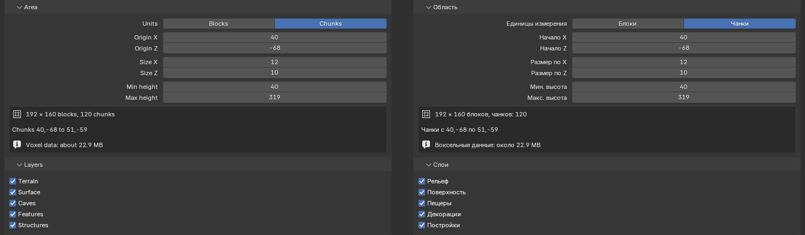

* **Units** — единицы **и начала, и размера** области: блоки или чанки. При переключении значения пересчитываются, область остаётся на месте (при переходе в чанки берётся ближайшая сетка чанков, накрывающая область).
* **Origin X / Origin Z** — западный и северный край области (мировые координаты как в игре: X на восток, Z на юг).
* **Size X / Size Z** — размер в тех же единицах. **В блоках — любое число** (например, 24 × 8): библиотека генерирует накрывающие чанки целиком (мир считается по чанкам 16×16), а сцена **обрезается точно по границам** области — лишние блоки не рисуются, на срезе видны боковые грани. В чанках — как раньше (ползунок до 64, жёсткий предел 512 чанков; в блоках предел 8176). Если начало не кратно 16, накрывающих чанков может быть на один больше (область 24 блока от x = 8 попадает в чанки 0 и 1).
* **Min height / Max height** — **диапазон показа**: блоки вне него не рисуются и не закрывают соседей. Библиотека всё равно строит полную колонку (−64…319 в Верхнем мире), так что это «срез» — удобно, чтобы заглянуть в пещеры или убрать потолок Нижнего мира (кадр с крепостью — срез по y = 86).
* Под полями — сводка: размер в блоках и число генерируемых чанков, точные диапазоны блоков и номера крайних чанков, **оценка памяти вокселей**. Если воксели не умещаются в 60 % оперативной памяти, Generate откажется (с указанием размера).

### 4.5. Layers (слои)

Слои — это стадии генерации; можно включать по отдельности:

| Слой | Что даёт |
|---|---|
| **Terrain** | камень, вода, лава, водоносные слои, крупные рудные жилы (заполнение шумом); без рельефа остаются только биомы |
| **Surface** | правила поверхности: трава, песок, бедрок, глубинный сланец, полосы глины, снег и лёд |
| **Caves** | пещеры, каньоны, карверы Нижнего мира, растекание жидкостей |
| **Features** | деревья, трава, цветы, руды-фичи, озёра, кораллы, сколк, геоды, капельник… |
| **Structures** | деревни, храмы, шахты, крепости, монумент, особняк, бастионы и другие (52 типа) |

По умолчанию включены Terrain, Surface и Caves (быстрая картинка); для кадров в этом документе включены все пять. Выключенный слой — меньше работы и меньше граней в сцене ([§9](#9-производительность-и-память)).

**Server schedule (расписание сервера)** — необязательное поле под слоем Features. Сама игра генерирует декорации в порядке, который зависит от гонки потоков, поэтому два
прогона одного мира на настоящем сервере расходятся на 0,15–0,25 % блоков (см. [`nondeterminism.md`](nondeterminism.md)); без расписания аддон строит «типичный» порядок.
Если нужно получить мир **точно таким, как на вашем сервере**, запишите расписание его прогона и укажите файл `.mcsched` (область, версия и сиды те же, что на сервере):

```bash
python3 tools/gt/record_schedule.py flags --dir ~/rec        # напечатает JVM-флаги записи (JFR) и положит chunkgen.jfc
java -Xmx4g -XX:StartFlightRecording=filename=~/rec/schedule.jfr,settings=~/rec/chunkgen.jfc,dumponexit=true -jar server.jar nogui
#   … сгенерируйте мир (forceload / подойдите к области), затем команда stop на сервере
python3 tools/gt/record_schedule.py convert ~/rec/schedule.jfr --dim overworld --out world.mcsched      # нужен JDK 17+ (инструмент jfr)
```

На записанных прогонах так получается 0 расхождений из 16,6 млн блоков (Overworld, Nether; 26.1–26.4, области вокруг точки появления тоже). Расписание относится к одному прогону одного мира и одному измерению; запись не содержит ничего личного
(позиции чанков, статусы, время шагов, чтения чанков с диска). Кроме порядка шагов в расписание входят **события чанков**: «чанк перезагружен с диска» (у 26.1/26.2 такой чанк теряет карты высот `*_WG`) и «чанк стал FULL»; для них в `chunkgen.jfc`
включено событие `minecraft.ChunkRegionRead` — записи, сделанные старым `chunkgen.jfc`, остаются рабочими, но без этих событий область вокруг точки появления на 26.1/26.2 может не совпасть (см. [`nondeterminism.md`](nondeterminism.md) §2.4). В `mcgen-cli`: `--schedule world.mcsched`; в C: `mcgen_world_set_schedule()`.

### 4.6. World Tweaks (настройки мира)

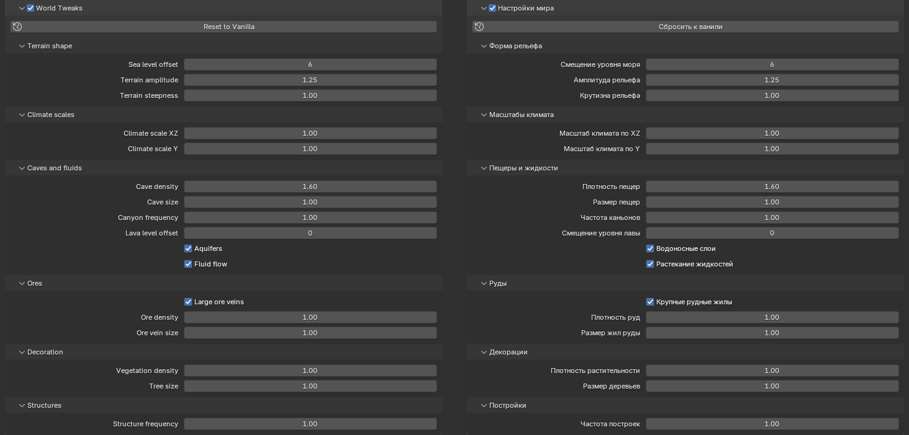

По умолчанию режим выключен, ползунки серые:

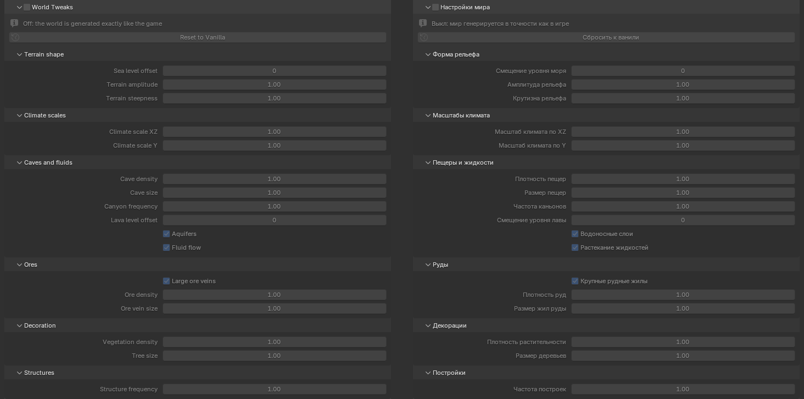

Галка в заголовке включает «режим настроек». **Выключена — мир побитово как в игре.** Включена — доступны 17 ползунков, которых в игре нет: они меняют параметры слоёв, а не данные датапака. Ползунки, не относящиеся к выбранному измерению, серые; **Reset to Vanilla** возвращает всё к ванили. Подписи и описания на русском берутся из `libmcgen/tweaks.json`.

| Группа | Настройка | Смысл |
|---|---|---|
| Terrain shape | Sea level offset (−128…128) | прибавка к уровню моря: поднимает/опускает линию воды и поверхность водоносных слоёв |
| | Terrain amplitude (0…8) | множитель вертикального размаха рельефа (холмы, горы, глубина океанов); 1 — ваниль |
| | Terrain steepness (0,05…8) | множитель крутизны склонов: >1 — обрывы, <1 — сглаженная земля |
| Climate scales | Climate scale XZ (0,05…16) | горизонтальный масштаб шумов климата: >1 растягивает биомы и материки |
| | Climate scale Y (0,05…16) | вертикальный масштаб: >1 растягивает слои подземных биомов (пышные и карстовые пещеры, глубокая тьма) вниз |
| Caves and fluids | Cave density (0…4) | доля пустот под землёй (сырные, спагетти, классические пещеры); 0 — без пещер |
| | Cave size (0,1…4) | радиус пещер и размер залов |
| | Canyon frequency (0…8) | вероятность каньонов |
| | Lava level offset (−64…128) | высота границы, ниже которой пещеры заливает лава (в ванили −54) |
| | Aquifers | водоносные слои; выкл. — ниже уровня моря все пустоты в воде, ниже лавы — в лаве |
| | Fluid flow | один раз растечь воде и лаве, как при переходе чанка в состояние FULL; выкл. — «чистое» заполнение шумом |
| Ores | Large ore veins | крупные жилы меди и железа |
| | Ore density (0…16) | множитель числа попыток разместить жилу на чанк |
| | Ore vein size (0,1…8) | множитель размера жил |
| Decoration | Vegetation density (0…8) | множитель числа деревьев, цветов, травы |
| | Tree size (0,25…6) | множитель высоты ствола и радиуса кроны |
| Structures | Structure frequency (0…8) | множитель плотности построек (интервал между постройками одного набора делится на него); 0 — без построек |

Примеры: **Tall Mountains (tweaked)** — большая амплитуда и крутизна, **Swiss Cheese Caves (tweaked)** — плотность и размер пещер выше нормы (оба — в списке пресетов). Менять ползунки удобно вместе с **Auto update** (панель View): сцена пересчитывается автоматически сразу после изменения, причём только затронутые стадии.

### 4.7. View (вид)

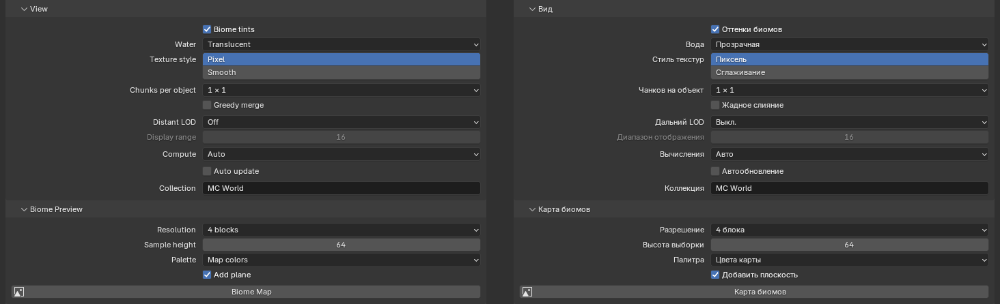

* **Biome tints** — оттенки травы, листвы и воды по цвету биома (как в игре: colormap по температуре и осадкам, цвета из JSON биома, болото и тёмный лес — по шуму). Выключено — единый нейтральный оттенок «равнин».
* **Water** — *Translucent* (полупрозрачная с текстурой), *Opaque* (сплошная поверхность), *Hidden* (воды нет, виден морской грунт).
* **Texture style** — *Pixel* (резкие пиксели, фильтр Closest) или *Smooth* (линейная фильтрация).
* **Chunks per object** — 1×1 / 2×2 / 4×4 / 8×8 чанков в одном объекте Blender. Больше — быстрее вьюпорт у огромных сцен, но правка блока перестраивает больше (для строительства оставьте 1×1).
* **Greedy merge** — «жадное слияние» плоских граней в большие прямоугольники с повторением текстуры в шейдере: граней почти вдвое меньше (5,8 → 3,1 млн на области 32×32) при той же картинке; **включено по умолчанию** (удобно для больших сцен, меньше памяти).
* **PBR materials** — карты нормалей, шероховатости, металличности и свечения, **выведенные из текстур блоков** (в ванили PBR-текстур нет): рельеф камня, кирпичей и коры, блеск металлов, стекла, льда и обсидиана, светящиеся блоки (светокамень, морской фонарь, магма, факелы, лава…). Выключено по умолчанию; работает в режиме освещения *Lit*; лишняя память — единицы МБ (карты размером с атлас), цена — время рендера (три выборки текстуры вместо одной). Правила — по именам спрайтов (46 правил на ≈1300 текстур, [`assets/pbr.py`](../../blender/mcgen_addon/assets/pbr.py)), без ручной разметки каждого блока.
* **Distant LOD** + **Display range** — вдали от центра области чанки рисуются упрощённо (колонки по карте высот), в радиусе Display range — полной геометрией.
* **Compute** — *Auto* / *CPU* / *GPU*: где считает генератор. По умолчанию Auto (видеокарта берёт карту биомов и рельеф областей от 256 чанков, 16×16; на меньших быстрее процессор — режим *GPU* выбирайте вручную, если хотите всегда считать на видеокарте**); без видеокарты NVIDIA и необязательной библиотеки CUDA всё считается на процессоре (результат при этом тот же, видеокарта лишь ускоряет там, где проходит самопроверка «GPU = CPU»).
* **Auto update** — пересчитывать (Update Layers) через мгновение после изменения любой настройки.
* **Collection** — имя коллекции Blender для объектов мира.

### 4.8. Edit Blocks (строительство и разрушение)

Подпанель только в боковой панели `N` (инструменты работают в 3D-виде). Подробно — [§7](#7-строительство-и-разрушение).

### 4.9. Biome Preview (карта биомов)

Разрешение карты (1…32 блока на пиксель), высота выборки биомов, палитра, плоскость в сцене — [§5](#5-карта-биомов).

### 4.10. Resources (ресурсы)

[§2](#2-первый-запуск-ресурсы-игры). Внизу панели — общие настройки аддона: **Generator** (Automatic — настоящая `libmcgen`, если найдена, иначе демо-макет; можно закрепить), **Threads** (0 — все ядра), **Scene builder** (Automatic — блоки с текстурами, когда ресурсы готовы, иначе упрощённый предпросмотр по карте высот).

### 4.11. Stats (статистика)

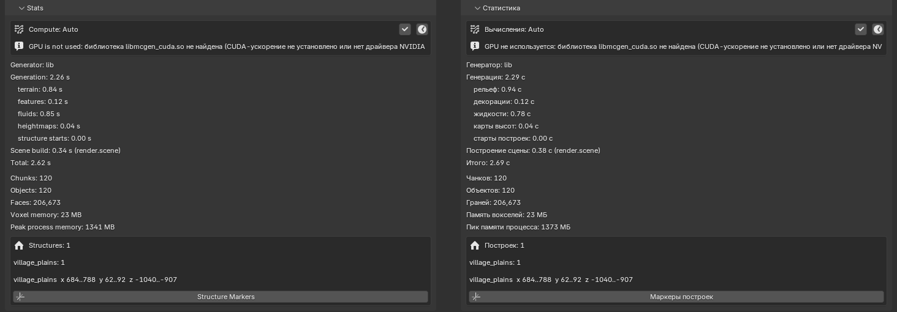

Время генерации по стадиям (рельеф, декорации, жидкости, карты высот, старты построек), время построения сцены и итого, число чанков, объектов и граней, память вокселей и **пик памяти процесса**. Ниже — **список построек**: сколько каких типов нашлось в области и первые из них с границами (мировые координаты `x … y … z …`). Кнопка **Structure Markers** ставит маркеры ([§6](#6-маркеры-построек)). Сверху — строка о том, где считалось (CPU/GPU).

### 4.12. Видеокарта NVIDIA (необязательно)

Видеокарта ускоряет **карту биомов** (в режиме Auto: на два порядка быстрее процессора) и, если выбрать **Compute ▸ GPU**, ещё и **рельеф** (измерено на RTX 4080 SUPER: 1,7–2,8× по времени, 3,4–3,9× по процессорному времени; подробности и честные числа — [gpu.md](gpu.md)). Результат **бит-в-бит такой же, как на процессоре**: перед использованием в Auto библиотека сверяет себя с процессором (кнопка **GPU Self-test**), и при любой неудаче всё считается на CPU.

Готовой библиотеки для вашей карты в аддоне нет — она **собирается вашим же nvcc** из наших исходников (они лежат в аддоне, папка `gpu_src`):

1. Поставьте **CUDA Toolkit** (nvcc), [developer.nvidia.com/cuda-downloads](https://developer.nvidia.com/cuda-downloads), и актуальный драйвер NVIDIA. Только **Windows:** nvcc требует компилятор Microsoft — поставьте бесплатные **Visual Studio Build Tools** ([visualstudio.microsoft.com/downloads](https://visualstudio.microsoft.com/downloads), «Инструменты сборки») с рабочей нагрузкой **«Разработка классических приложений на C++»**. Linux: нужен gcc/g++.
2. Перезапустите Blender (чтобы он увидел `PATH` / `CUDA_PATH` после установки).
3. Откройте панель **Stats**: в блоке *Compute*, пока GPU не готов, есть кнопка **Build GPU library**. Нажмите её: аддон найдёт nvcc и Visual Studio сам, определит вашу карту (`nvidia-smi`) и соберёт библиотеку под неё — от 2 до 10 минут, идёт в фоне, Esc отменяет.
4. Нажмите **GPU Self-test** (должно быть «Self-test passed») и **GPU Benchmark**; в View ▸ **Compute** выберите *GPU*, если нужен ускоренный рельеф.

Библиотека лежит в кэше аддона (`<кэш>\gpu\mcgen_cuda.dll`, на Linux `libmcgen_cuda.so`) и подключается сама при каждом запуске; журнал сборки — `<кэш>\gpu\build.log` (там же список архитектур). Пересобирать нужно только при смене видеокарты или обновлении аддона. Если загруженный Windows-файл нельзя заменить на лету, аддон положит новый рядом и подставит при следующем запуске Blender.

**Если не собралось.** «nvcc not found» — добавьте каталог `bin` CUDA в `PATH` или задайте `CUDA_PATH` и перезапустите Blender. «Microsoft C++ compiler was not found» — нет Build Tools с нагрузкой «C++» (nvcc в Windows без `cl.exe` не работает). Слишком новая Visual Studio для вашей версии CUDA — аддон сам повторяет сборку с `-allow-unsupported-compiler`, но самый надёжный путь — свежий CUDA Toolkit. Карты RTX 50 (`sm_120`) требуют CUDA 12.8+; для более новых карт, чем знает ваш nvcc, остаётся вариант «PTX» (драйвер доскомпилирует его при первом запуске, это медленнее). Сборку на Windows автор проверить не мог (нет Windows-машины с MSVC): если что-то не так, пришлите `build.log`. Без Blender: `libmcgen\gpu\build.bat` в «x64 Native Tools Command Prompt» (результат — `mcgen_cuda.dll`, положите его в `<кэш>\gpu\`).

## 5. Карта биомов

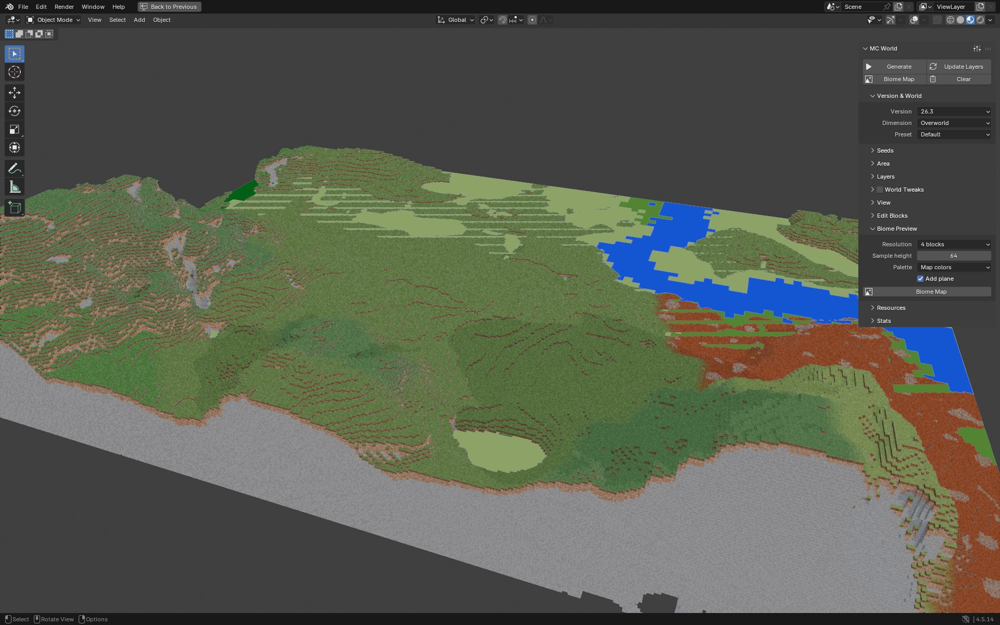

**Biome Map** строит картинку биомов области **без рельефа** — за доли секунды даже для больших областей (карта 32×32 чанков при шаге 4 — десятые доли секунды). Это способ выбрать место, прежде чем генерировать блоки.

* **Resolution** — блоков на пиксель (1…32; для очень больших областей шаг растёт автоматически, чтобы картинка не превышала 4096×4096).
* **Sample height** — высота, на которой берутся биомы (важно под землёй: пещерные биомы зависят от глубины).
* **Palette** — *Map colors* (привычные цвета карты), *Hash* (цвет от имени биома), *Biome JSON* (цвета воды и травы из файлов биомов).
* **Add plane** — добавить плоскость с картой: она ложится на область **на высоте выборки** (на кадре — y = 64: там, где рельеф ниже, видна карта, там, где выше — земля). Картинка `MCGen Biomes <измерение>` упаковывается в .blend, север сверху.

## 6. Маркеры построек

После генерации со слоем **Structures** панель Stats перечисляет найденные постройки. Кнопка **Structure Markers** (в блоке «Structures») ставит на каждую пустышку-«коробку» **Empty** с размерами **bounding box** постройки и именем типа (`village_plains 38,-62`). Маркеры лежат в той же системе координат, что и блоки: их удобно использовать как ориентиры для камеры, для навигации к деревне или крепости, для привязки света. **Clear** убирает маркеры вместе с миром; повторное нажатие кнопки пересоздаёт их.

Поиск мест «по построй­кам» можно делать и вне Blender: `mcgen-cli` и функции библиотеки `mcgen_structure_starts` / `mcgen_biome_at` дают те же данные без генерации блоков (так подбирались места для кадров в этом документе: `blender/tests/showcase/find_spots.py`).

## 7. Строительство и разрушение

Блоки — это данные, поэтому ставить и ломать их можно, не создавая новых объектов: аддон находит блок под курсором лучом по мешу чанка, правит массив блоков и перестраивает только затронутый чанк (и соседей на границе — швов нет). Это занимает единицы миллисекунд.

Откройте в боковой панели `N` ▸ «MC World» подпанель **Edit Blocks** (она активна после генерации настоящим построителем сцены):

* поле с **именем блока** (`stone`, `oak_stairs`, `minecraft:glass`; `minecraft:` можно не писать);
* **Place Block** — модальный инструмент «Поставить»: блок ставится рядом с гранью под курсором; ориентация (`facing`, `half`, `axis`…) берётся по виду и месту клика, как у игрока: ступени, двери, кровати, знаки, факелы, брёвна;
* **Break Block** — «Сломать»: двери, кровати и высокие растения ломаются целиком;
* **Pick Block** — «Пипетка»: берёт блок под курсором (с его состоянием) как ставимый и подставляет его имя в поле;
* **Undo Block Edit / Redo Block Edit** — отмена и повтор правок (глубина 1000).

**Горячие клавиши внутри инструмента:** **ЛКМ** — применить, **ПКМ** или **Esc** — выйти из инструмента, **Ctrl+Z** / **Ctrl+Shift+Z** — отмена / повтор; навигация по виду (колесо, средняя кнопка, Alt+ЛКМ, цифровая клавиатура) работает как обычно. Блок под курсором подсвечивается рамкой (зелёной — «поставить», красной — «сломать», синей — «пипетка»). Постоянных клавиш на запуск инструментов аддон не назначает, чтобы не конфликтовать с вашими: любой из операторов можно привязать к клавише — правый клик по кнопке ▸ **Assign Shortcut**.

**Автосвязи** работают по правилам ванили: заборы, стеклянные панели, решётки, стены (низкие и высокие), ступени (внутренние и внешние углы), плиты (двойные), двери (петля, верх и низ), кровати, ворота, высокие растения, «снежная» трава (`snowy`), хорус, `waterlogged`.

Правки **сохраняются в .blend** и накладываются заново, когда мир (версия, измерение, пресет и все четыре сида) тот же — см. [§8](#8-сохранение-blend-и-загрузить-воксели). Чтобы выбросить все правки, нажмите **Discard Edits** (появляется, когда в файле есть сохранённые правки): мир пересоберётся как сгенерированный.

> Не моделируется выживание: растения не осыпаются без опоры, вода и лава не текут после правки, не работают редстоун-связи и поршни.

## 8. Сохранение .blend и «Загрузить воксели»

**Сохранять .blend можно как обычно.** В файл попадают: все настройки аддона (сиды, область, слои, «настройки мира», вид), статистика, **готовые меши** мира, упакованная картинка карты биомов, маркеры и **слой правок** (текстовый блок «MC World edits»). **Воксельные данные в файл не сохраняются** — они воспроизводятся по настройкам (генерация детерминирована: те же настройки дают тот же мир).

После открытия файла мир на экране есть (меши сохранены), но инструменты строительства пока недоступны, а в панели вместо подсказки «Set the area and press Generate» стоит предупреждение и кнопка **Load Voxels** («Загрузить воксели»). Она:

1. заново генерирует область по сохранённым настройкам (рельеф, пещеры, декорации, постройки);
2. пересобирает сцену **без дубликатов** (старые меши заменяются);
3. накладывает сохранённые **правки блоков** (если версия, измерение, пресет и сиды те же), после чего инструменты строительства снова работают.

То же сделает **Update Layers** (он тоже восстанавливает воксели по сохранённым настройкам). Дополнительный дисковый кэш вокселей по хэшу настроек не делается: генерация быстрая ([§9](#9-производительность-и-память)).

Если сменить сид (или версию, измерение, пресет), сохранённые правки к новому миру **не применяются** (они остаются в файле, пока вы не нажмёте **Discard Edits** или не сделаете новые правки).

## 9. Производительность и память

Измерено на 12 ядрах (WSL2, Ubuntu, машина разделена с другими задачами — числа плавают до ×2), настоящая `libmcgen`, расширение установлено в чистый профиль, сид 12345, Верхний мир, область 32×32 чанков = 1024 чанка (512×512 блоков), **все пять слоёв**:

| | Blender 4.5.14 | Blender 5.2.2 |
|---|---|---|
| Prepare Resources с нуля (jar → кэш: датапак, reports, block_flags, ресурсы клиента) | 21.8 с | 22.0 с |
| **Generate 32×32 всего** (первый запуск: включая сборку таблицы состояний) | **21.7 с** | **16.8 с** |
| — генерация libmcgen (12 потоков) | 8.6 с | 7.0 с |
| — рельеф / жидкости / декорации / карты высот | 4.3 / 3.1 / 0.9 / 0.1 с | 3.4 / 2.4 / 0.8 / 0.1 с |
| — построение сцены (`SceneBuilder`) | 12.8 с | 9.5 с |
| объектов / граней | 1024 / 6.0 М | 1024 / 6.0 М |
| построек в области | 17 | 17 |
| воксели (область 32×32) | 196 МиБ | 196 МиБ |
| память процесса после Generate (RSS; Blender, таблицы, воксели, меши) | 2231 МиБ | 2093 МиБ |
| пик памяти процесса за весь сценарий (на открытии .blend) | 4213 МиБ | 3778 МиБ |
| «Поставить» / «Сломать» блок (всего, из них перестройка меша) | 3.8 (3.4) мс / 3.8 (3.7) мс | 4.4 (3.6) мс / 3.6 (3.5) мс |
| сохранение .blend / размер / открытие | 1.82 с / 972 МБ / 4.76 с | 0.65 с / 122 МБ / 2.36 с |
| Load Voxels после открытия файла | 14.3 с | 9.5 с |
| Update Layers (смена уровня моря, все чанки затронуты) | 15.8 с | 9.6 с |

Когда таблица состояний блоков уже в кэше (любой запуск, кроме самого первого), **Generate 32×32 со всеми слоями занимает ≈ 10–12 с** (генерация ≈ 7–8,5 с, сцена ≈ 2,5–3,3 с), а **Update Layers** после смены слоя Structures — ≈ 10 с. Отмена (**Esc**) посреди генерации срабатывает за доли секунды (0,05–0,09 с).

Размер .blend определяется мешами (6 млн граней на 32×32): Blender 4.5 пишет их без сжатия (≈ 1 ГБ), Blender 5.2 — заметно компактнее. Воксели в файл не сохраняются ([§8](#8-сохранение-blend-и-загрузить-воксели)). Пик памяти приходится на открытие такого файла (старые меши + новые после **Load Voxels**).

Что из этого следует:

* **Память вокселей** — ≈196 КиБ на чанк Верхнего мира (блоки 16×384×16 × 2 байта = 192 КиБ, плюс биомы и карты высот): 8×8 чанков ≈ 12 МиБ, 32×32 ≈ 196 МиБ, 64×64 ≈ 780 МиБ; Нижний мир и Энд компактнее (высота 256). Кроме вокселей процесс держит таблицы блоков и текстур, меши сцены и сам Blender: на 32×32 после Generate процесс занимает ≈ 2,1–2,2 ГиБ (см. таблицу), на 16×16 — ≈ 1,1–1,4 ГиБ; повторные Generate / Update Layers память не накапливают (утечка при пересборках была найдена и исправлена при финальной проверке). Аддон отказывается генерировать, если воксели превышают 60 % оперативной памяти.
* **Ресурсы** готовятся один раз; первая сборка сцены после этого строит таблицу состояний (8–15 с, кэшируется на диск и потом загружается за ≈0,1 с).
* **Правка блока** занимает единицы миллисекунд (мс на перестройку меша чанка — в таблице).
* Для больших сцен: **Greedy merge** (включён по умолчанию), **Distant LOD**, **Chunks per object** 4×4 или 8×8 (но для правок оставьте 1×1: правка пересобирает всю группу — 9 мс для 2×2, 38 мс для 4×4, 160 мс для 8×8 против 3 мс для 1×1); ненужные слои (Features, Structures) можно отключить на время компоновки кадра, а диапазон **Y min / Y max** обрезает недра, если они не нужны в кадре.

### 9.1. Как расходуется память и что уже сделано

Пик памяти процесса (RSS) полного конвейера 32×32 чанков, все пять слоёв, Blender 5.2.2 без окна (видеопамять не входит), одна и та же машина, шаги включаются по очереди:

| конфигурация | граней | пик RSS |
|---|---:|---:|
| как в v0.1.13 (без слияния граней, без сварки вершин, без освобождения памяти) | 5,77 млн | 1825 МиБ |
| + слияние граней (теперь по умолчанию) | 3,11 млн | 1446 МиБ |
| + сварка общих вершин и рёбер, плоское затенение | 3,11 млн | 1340 МиБ |
| + освобождение страниц воздуха в вокселях и возврат кучи системе (то, что есть сейчас) | 3,11 млн | **1234 МиБ (−32 %)** |
| то же + PBR-материалы | 3,11 млн | 1238 МиБ |
| 4×4 или 8×8 чанков на объект (в v0.1.13 при этом держались копии мешей всех чанков группы — +330–360 МиБ) | 3,11 млн | 1213 / 1227 МиБ |

* **Сварка вершин.** Раньше у каждой грани были свои 4 вершины и 4 ребра (≈160 байт на грань в Blender); теперь общие углы — одна вершина (вершин на 73 %, рёбер на 53 % меньше без слияния граней), а чтобы Blender не усреднял нормали соседних граней, грани помечены плоскими (`sharp_face`). Картинка не меняется (проверено: позиции углов те же, нормали углов = нормалям граней).
* **Воксели.** Воздух над поверхностью — больше половины массива блоков (мир −64…320, поверхность около 63–150): страницы памяти, целиком заполненные воздухом, возвращаются системе (Linux и macOS; на Windows не делается), содержимое то же (контрольная сумма всех блоков совпадает с освобождением и без него); на Linux проверено, macOS собрана, но не запускалась. Кроме того, после генерации возвращается куча, занятая рабочими буферами стадий (glibc). Для региона 24×24 чанков, слои до Features: 272 → 132 МиБ резидентной памяти библиотеки.
* **Не сделано намеренно:** отбрасывание замкнутых пещер и водоносных горизонтов («только внешняя поверхность») — мир остаётся копией игры 1:1, все грани видимой геометрии на месте.
* **Не измерено:** память Blender под глобальный undo и видеопамять — в этом окружении нет окна с видеокартой. В самом Blender они уменьшаются настройками **Edit ▸ Preferences ▸ Editing ▸ Undo ▸ Steps** (на огромных сценах хватит 4–8) и **Undo Memory Limit**; видеопамять на грань порядка 100–130 байт (оценка по формату буферов Blender) — её снижают те же Greedy merge, Distant LOD и Y min / Y max.
* Предельный размер области — 512×512 чанков (но 512×512 чанков — это 48,9 ГБ вокселей; на практике — до нескольких сотен чанков по стороне).

## 10. Частые проблемы

| Симптом | Причина и решение |
|---|---|
| Плашка «Demo generator» | не нашлась `libmcgen` для вашей платформы (zip не от той платформы или библиотека не загрузилась); поставьте zip своей платформы; в Resources ▸ Generator значение **libmcgen** вместо Automatic покажет настоящую причину ошибкой вместо тихого перехода на макет |
| «Resources not prepared» / Generate отказывается | не выполнена **Prepare Resources** для выбранной версии; галки «ready» в панели Resources должны быть все |
| «Java 25+ not found» | установите JRE 25 (Temurin/Adoptium, Oracle, Microsoft…) или укажите её в поле **Java**; можно взять среду лаунчера Minecraft. Без Java: поле **Reports folder** с готовым `reports/blocks.json` |
| «Block flags: missing» | не удалось выполнить наш класс правил декораций (нет Java) — генерация работает, но часть декораций использует эвристики |
| «The cache folder … is hidden from other programs» / «Unable to access jarfile» / «`build_gpu.bat` не является внутренней…» (Windows) | Blender из Microsoft Store: AppData виртуализировано, внешние программы (Java, cmd, nvcc) не видят файлов кэша — см. [§2.1](#21-свои-jar-официальный-лаунчер-multimc--prism-modrinth). Аддон 0.1.3+ сам берёт `%USERPROFILE%\.mcgen`; на 0.1.2 задайте в настройках **Cache folder** = `C:\mcgen`, выберите jar заново и нажмите Prepare Resources |
| «The cache folder path is too long for Windows» / `FileNotFoundError` при Prepare Resources (Windows) | путь кэша + имена датапака длиннее 259 символов (типично для Blender из Microsoft Store). Аддон версии 0.1.2+ выбирает короткий `%LOCALAPPDATA%\mcgen` сам; если вы задали **Cache folder** — укажите короткую, например `C:\mcgen`, и снова нажмите Prepare Resources (после **Clear Cache** файл jar в кэше исчезает: выберите jar заново или нажмите Download) |
| «The jar file … does not exist» | файл jar из полей удалён или перенесён — чаще всего после **Clear Cache** (скачанный Download jar лежал в кэше); выберите jar заново или нажмите Download |
| «… does not look like a Mojang server/client jar» | это не чистый jar Mojang (нет `version.json`), он повреждён или перепутаны server и client; см. [§2.1](#21-свои-jar-официальный-лаунчер-multimc--prism-modrinth) |
| Auto-detect: «Found 0 server and 1 client jars» | лаунчеры не хранят серверный jar: нажмите Download (с галкой EULA) или скачайте `server.jar` на minecraft.net и укажите его в поле Server jar |
| Download неактивна | не принята EULA (галка) или в Blender выключен доступ в сеть: Preferences ▸ System ▸ Network ▸ Allow Online Access |
| «The voxel data … needs about N GB» | область слишком велика для вашей памяти; уменьшите Size X/Z или срежьте диапазон высот |
| Генерация медленная | большая область или все слои: уменьшите область, выключите ненужные слои; для сцены — Greedy merge, LOD и Chunks per object; **Threads** = 0 использует все ядра; самые тяжёлые стадии — рельеф и растекание жидкостей ([§9](#9-производительность-и-память)) |
| Инструменты Edit Blocks серые | нет построенной сцены в этой сессии: нажмите Generate (или Load Voxels после открытия файла) |
| После открытия .blend нет вокселей | так и задумано, [§8](#8-сохранение-blend-и-загрузить-воксели): кнопка **Load Voxels** |
| Маркеры построек не там | нажмите Structure Markers после генерации ещё раз (маркеры строятся по последнему результату) |
| «GPU is not used» | нет видеокарты NVIDIA, драйвера или библиотеки CUDA — всё считается на процессоре, результат не меняется; библиотеку собирает кнопка **Build GPU library** в Stats ▸ Compute ([§4.12](#412-видеокарта-nvidia-необязательно)) |
| Блок рисуется чёрным | таких блоков обычно нет; блоки-сущности (сундуки, головы, баннеры) рисуются упрощёнными заглушками (узоры баннеров — слоями поверх полотна), а темноватые модели (кусты светлячков) просто тёмные |

## 11. Известные ограничения

Подробности — [`assets-mesh.md`](assets-mesh.md) §8, [`accuracy.md`](accuracy.md), [`status.md`](status.md).

* **Свет.** Освещение игры (блочный и небесный свет, ambient occlusion, сглаживание) **не воспроизводится**: сцену освещает Blender. Лава и светящиеся блоки сами не светят (добавьте свет вручную или режим Emission).
* **Анимации.** Текстуры анимаций — только первый кадр; нет анимации крышек, колоколов, листвы на ветру, частиц, воды в движении.
* **Сундуки и сущности.** Блоки-сущности рисуются заглушками (сундуки, шулкеры, баннеры с узорами из построек, головы без ушей и шляп, голова дракона на корабле города Края, колокол, плоскость портала Энда; декоративные горшки залов испытаний с черепками, статуи медного голема; проводник и шлюз Края не рисуются — в мире не появляются); **содержимого сундуков и мобов нет** (и не планируется).
* **Недетерминизм игры.** Стадия декораций в самой игре недетерминирована: два прогона одного и того же мира расходятся на ≈0,25 % блоков Верхнего мира (≈0,13 % Нижнего). Поэтому на плотных лесах и грибных пещерах расположение отдельных деревьев может отличаться от того, что вы увидите в игре; рельеф, пещеры и поверхность совпадают с игрой точно, декорации — на «стабильных» клетках точно (подробные цифры — `accuracy.md`).
* **Версии.** Поддерживаются 26.1, 26.2, 26.3 и 26.4-snapshot-2; старые (до 26.1) — нет.
* **Платформы.** Полностью проверено только на Linux. Windows: библиотека загружается в Blender 5.2 (Microsoft Store), но весь путь «ресурсы → генерация» и сборка GPU-библиотеки на живой Windows ещё не подтверждены (исправления v0.1.2–v0.1.3 сделаны по отчётам об ошибках); macOS: библиотеки собираются и проходят проверку экспорта, но не запускались.
* **Оттенки.** Биомы берутся клетками 4×4×4 без «зума» игры (границы биомов чуть «дрожат» в самой игре); умножение оттенка на текстуру — в линейном пространстве Blender (до нескольких процентов яркости).
* **Прозрачность.** Порядок полупрозрачных граней (вода, стекло) решает Blender: на стыках стекла и воды возможны артефакты.
* **Автосвязи после правки** — только по правилам ванили, без выживания блоков (см. §7).

## 12. Правовая сторона

* **Minecraft** — торговая марка Mojang Studios / Microsoft; проект ни с ними не связан и не одобрен ими.
* **Ресурсы Mojang** (датапак, список блоков, модели, blockstates, текстуры, цветовые карты) в аддон и репозиторий **не входят**. Аддон читает их на лету из **вашего** jar и держит распакованный кэш на вашем диске. Файлы кэша не предназначены для распространения.
* **EULA.** Скачивание jar кнопкой Download возможно **только** с явно поставленной галкой «I accept the Minecraft EULA» (https://aka.ms/MinecraftEULA) и разрешённым доступом в сеть Blender; без галки аддон ничего не качает. Можно обойтись без скачивания и указать jar, которые у вас уже есть. Единственный сетевой адрес, к которому обращается аддон, — официальный манифест и серверы загрузки Mojang (`piston-meta.mojang.com` и ссылки из него).
* **Картинки.** Кадры в этом документе — рендеры мира, построенного аддоном; на них видны текстуры игры, поэтому относитесь к ним как к скриншотам игры. Сами файлы текстур и моделей в репозитории не лежат.
* **Лицензия** кода аддона и библиотеки — MIT (см. `LICENSE`). Разрешения расширения: `files` (чтение ваших jar и кэш) и `network` (необязательно, скачивание jar).

---

## Приложение: текст раздела «Как пользоваться» для README

> Готовый абзац для корневого `README.md` (раздел про аддон):
>
> **Как пользоваться.** Соберите расширение `python3 tools/build_extension.py` (или возьмите готовый zip из `blender/dist/`) и поставьте его в Blender 4.2+ через **Edit ▸ Preferences ▸ Get Extensions ▸ Install from Disk…**. В **Scene ▸ MC World ▸ Resources** укажите (или найдите кнопкой **Auto-detect**) серверный и клиентский jar одной версии, нажмите **Prepare Resources** (нужна Java 25; ресурсы Mojang берутся из вашего jar и в репозиторий не входят). Затем выберите версию, измерение, seed и область в чанках, включите слои и нажмите **Generate**: мир строится настоящими блоками с текстурами; **Update Layers** пересчитывает только затронутое, **Biome Map** показывает карту биомов, **Structure Markers** отмечает постройки, а подпанель **Edit Blocks** позволяет ставить и ломать блоки (правки сохраняются в .blend). Подробно — [`docs/blender/user-guide.md`](docs/blender/user-guide.md).
